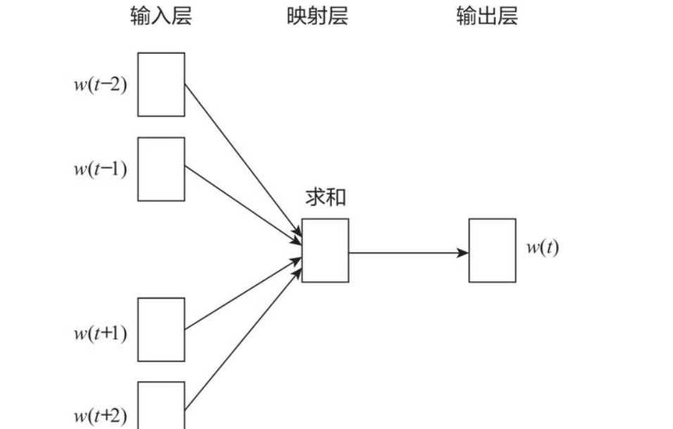

# 《LLM核心技术揭秘：从Tokenization到Embedding，一文读懂大模型的底层逻辑》

## 1.tokenizatiion

**为什么我们需要对文本进行分词呢**？

大模型推理流程：

文本(经过tokenization) ---------->数字矩阵（输入到大模型）---------->模型输出矩阵（经过tokenization） ---------->文本被重新表示

所谓**tokenization**，直译为**分词**，不过我们一般不说中文，直接念作"tokenization”，(可能是更高大上吧)

这里还要补充一个知识点**token**，直译为**词元**，是文本的基本单位。是比句子更小的单位，在中文一个词或者一个字就是一个token，在英文一个单词就是一个token，具体取决于**分词**的规则。token可以是**单词、标点符号、短语、甚至是字符**。

**Vocabulary词表** 是由所有词元组成的列表，可以类比为字典

举个例子

```python
"I love you"
```

经过tokenzation后变成

```python
["I", "love", "you"]
```

可以看出tokenzation的作用就是将句子变成一个个token，方便模型处理。

在对文本进行**预处理**时，tokenzation的作用是**将句子变成一个个token**，方便模型处理。

在预处理的流程中

**原始语料库**(web,books,new...) --->**数据清洗**(去除标点符号，去停用词，去重...)--->**分词**(将句子变成一个个token)

## 2.token的粒度

### 2.1 word-level 

#### **token为单词，单词级**

还是举个例子

```python
"I love you" --> ["I", "love", "you"]
```

看到分词后的token为一个个单词，即为 word-level

### 2.2 character-level

#### **token为字符，字符级**

```python
"I love you" --> ["I", "l", "o", "v", "e", "y", "o", "u"]
```

我们可以很直观的看到分词后的token为一个个字符，即为 character-level

### 2.3 subword-level

#### 子词级分词 

它是一种介于**字符集**和**单词集**之间的一种分词方式，它将句子中的单词进行分解，通过将文本分解为比单词更小、但比字符更大的单元（即子词），来平衡分词的粒度。

子词级分词的核心在于：**常用词保持完整**，而**稀有词**则分解为有意义的子词。这种方法可以有效**处理低频词和未登录词**（Out-of-Vocabulary, OOV）的问题，同时避免生成庞大的词表

它理解起来还是非常有难度的，我们先看个例子

假设有这样一段文本作为**原始文本**：

```python
"natural language processing is fun"
"processing natural language is fun"
"natural language is fun"
```
然后进行**字符级的初始化**得到初始的Vocabulary即是**初始词表**，注意词表都是一个哈希表。

```python
['n', 'a', 't', 'u', 'r', 'l', ' ', 'p', 'o', 'c', 'e', 's', 'i', 'g', 'f', 'm']
```

那么我们就可以进行字符对的合并
子词级分词的核心思想是逐步合并频率最高的字符对，直到达到预设的词汇表大小或无法再合并为止。

#### 1.统计字符对的出现次数

在初始文本中，统计所有相邻字符对的出现频率

```python
'na' 出现了2次
'at' 出现了2次
'tu' 出现了2次
'ur' 出现了2次
'rl' 出现了2次
'la' 出现了3次
'ng' 出现了1次
'al' 出现了1次
'l ' 出现了3次
' p' 出现了2次
'pr' 出现了2次
'ro' 出现了2次
'oc' 出现了2次
'ce' 出现了2次
'es' 出现了2次
'si' 出现了2次
'is' 出现了3次
' f' 出现了3次
'fu' 出现了3次
'un' 出现了3次
```

#### 2.合并出现频率最高的字符对

假设 'la' 和 'is' 的频率最高（均为3次），我们选择合并 'is'，因为它在多个单词中出现。合并后，词汇表更新为

```python
['n', 'a', 't', 'u', 'r', 'l', ' ', 'p', 'o', 'c', 'e', 's', 'i', 'g', 'f', 'm', 'is']
```
同时，文本被重新表示为

```python
"natural language proce##is##ing is fun"
"proce##is##ing natural language is fun"
"natural language is fun"
```

#### 3.继续合并

继续统计字符对的频率并合并。例如，接下来可能合并 '##is' 和 '##ing'，因为
它们在 'processing' 中频繁出现。经过多次迭代后，词汇表逐渐扩展，包含更多
子词单元。

#### 4.最终结果

经过若干次合并后，假设我们得到了以下词汇表：

```python
['n', 'a', 't', 'u', 'r', 'l', ' ', 'p', 'o', 'c', 'e', 's', 'i', 'g', 'f', 'm', 'is', '##is', '##ing', '##fun']
```

此时原始文本被分词为

```python
"natural language proce##is##ing is fun" → ["natural", "language", "proce", "##is", "##ing", "is", "fun"]
```

### 2.4为什么我们需要使用子词级分词

**1.处理低频词**：即使某些单词（如 "processing"）在训练数据中出现频率较低，BPE 仍然可以将其分解为常见的子词单元（如 "proce", "##is", "##ing"）并且低频词的意思可以得到保留，比如“cat” 和 “cats” 可能都会被分割为同一个token "cat#".

**灵活性**：子词级分词可以根据数据动态调整，适合多种语言和任务。

**减少词汇表大小**：相比于单词级分词，子词级分词可以显著减少词汇表的大小，同时避免未登录词（OOV）问题，未登录词（Out-of-Vocabulary，简称 OOV）是指在训练语言模型或自然语言处理系统时，测试数据中出现的、但在训练数据中从未见过的单词或词汇单元。换句话说，这些词在模型的词汇表（Vocabulary）中不存在，因此模型无法直接处理它们。

### 2.5 对比其他分词方法

**字符级分词（character-level**：会将每个字符视为**独立单元**，如 

```python
"processing" → ['p', 'r', 'o', 'c', 'e', 's', 's', 'i', 'n', 'g']
```

粒度过细，模型训练效率低。字符本身无意义，序列会非常长，训练时间长。

**单词级分词（word-level）**：

会将整个单词视为单元，用一些分格符划分（如空格和标点）如 "processing" → ['processing']，但如果遇到**未登录词**，模型无法处理，只能标注为**停用词 unk**

并且相近的words会划分为**不相关的**token，比如**cat 和 cats**，它们在语义上很相似，但被分为两个token，这会降低模型的泛化能力。

对于没有**分隔符**的语言难以划分，比如**中文**。

**子词级分词（subword-level）**：

**优势**词表是**动态构建的**，出现频率高的word有自己token，出现频率低的word会被划分为sub-word.

## 3.Subword Tokenization: Byte Pair Encoding (BPE，字节对编码)

BPE 是目前LLM中最常用的词元化方法，比如GPT系列的模型。
其实在上述介绍子词级分词时，已经提到了**BPE**，这里再详细说明一下。

1、初始化词表，每个字符为一个词元（字母、数字、标点符号）
2、将频率最高的一对词元合并为一个词元，词表大小+1
3、根据合并后的词元对语料重新分词（2中的一对词元都替换成新词元）
4、重复第2-3步，直到词表大小达到要求

其中**注意**

1. 将文本**词元化**，一般进行**字符级**分词
2. 将文本中的词元转换为索引
3. 词表中需要添加一些**特殊字符**，表示**停用词unk**，**填充pad**，**开始词元bos**，**结束词元eos**，
等等

| Token  | Index | Token  | Index |
|--------|-------|--------|-------|
| "beer" | 0     | "unk"  | 6     |
| "i"    | 1     | "pad"  | 7     |
| "want" | 2     | "bos"  | 8     |
| "a"    | 3     | "eos"  | 9     |
| "is"   | 4     |        |       |
| "cute" | 5     |        |       |

## 3.Embedding （词嵌入）

所谓的Embedding 是机器学习和深度学习中将离散变量（如单词、字符、标签等）映射到连续向量空间的一种方法。这种映射能够捕捉变量之间的复杂关系，并使它们可以被机器学习模型处理。

翻译成大白话就是模型的输入必须是数字矩阵，我们不能将字符输入到模型中，所以需要将字符映射到数字，这个过程就是Embedding。

举个例子，我们可以将字符映射到数字，比如"a"映射到1，"b"映射到2，"c"映射到3，以此类推。这样，我们可以将字符输入到模型中，模型就可以处理这些数字矩阵，从而实现对字符的表示。

```python
"helo world" → [1, 2, 3, 4, 5, 6, 7, 8, 9, 10]
```

###  3.1 最简单粗暴的Embedding：one-hot编码(独热编码)

表示方法：对于大小为N的词表，用长度为N的向量表示token，向量中token索引对应的值为1，其
余值为0
缺陷：无法准确表达不同词之间的相似度（任意两个token的余弦相似度为0）
维度较高，稀疏表示，计算不友好

```python
a --> [0, 1, 0, 0, 0, 0, 0, 0, 0, 0]
b --> [0, 0, 1, 0, 0, 0, 0, 0, 0, 0]
c --> [0, 0, 0, 1, 0, 0, 0, 0, 0, 0]
...
```

### 3.2 高效的Embedding：word2vec(word to vector)

在深度学习中我们习惯把发"to"的音写作2（two）
word2vec是Google在2013年提出的一种词向量模型，它通过**训练神经网络**来学习单词的向量表示，以表示单词之间的语义关系。
它和one-hot编码不同 ，它不是基于规则的，而是通过神经网络来学习，因此可以更准确地表示单词之间的**相似度**。

优势：可以较为准确的表达不同词之间的**相似性和关系**
稠密表示，维度降低，计算更加友好

常用的两个模型：**Continuous Bag-of-Words（CBOW，连续词袋模型）** 和 **Skip-gram（跳元模型）**

#### 3.2.1 Continuous Bag-of-Words（CBOW，连续词袋模型）



CBOW 的主要目标是根据**上下文单词**来**预测目标单词**。
CBOW模型中的**w(t)**为目标词，在已知它的上下文w(t-1),w(t+1)，w(t-2),w(t+2)等上下文单词后，模型会根据上下文预测目标单词。

$$
L = \sum_{w \in C} \log p(w | \text{context}(w))
$$

其中，\(C\) 是词汇表，\(p(w | \text{context}(w))\) 是在给定上下文条件下目标词 \(w\) 出现的概率。

在CBOW模型中，这个概率可以通过下面的公式计算：

$$
p(w | \text{context}(w)) = \frac{\exp({v_w}^T \cdot h)}{\sum_{w' \in V} \exp({v_{w'}}^T \cdot h)}
$$

这里，\(v_w\) 是目标词 \(w\) 的词向量，\(h\) 是上下文的词向量的平均或求和（取决于实现），\(V\) 是词汇表中所有词的集合。

因此，目标函数 \(L\) 可以进一步展开为：

$$
L = \sum_{w \in C} \log \left( \frac{\exp({v_w}^T \cdot h)}{\sum_{w' \in V} \exp({v_{w'}}^T \cdot h)} \right)
$$

如果经历过近十几年的高考，应该就明白这是类似**选词填空**的模式，我们把上下文输入到CBOW模型中，模型会根据上下文预测目标单词，比如"I like apple too"，模型会根据"I like __  too"来预测"apple"。

下面是使用pytorch实现的一个CBOW类代码

```python
import torch
import torch.nn as nn
import torch.optim as optim

class CBOW(nn.Module):
    def __init__(self, vocab_size, vector_size, context_size):
        super(CBOW, self).__init__()
        self.embedding = nn.Embedding(vocab_size, vector_size)
        self.linear = nn.Linear(vector_size, vocab_size)
        self.context_size = context_size

    def forward(self, inputs):
        # inputs: (batch_size, context_size * 2)
        # embedding: (batch_size, context_size * 2, vector_size)
        embeddings = self.embedding(inputs)
        
        # sum the embeddings
        # sum_embeddings: (batch_size, vector_size)
        sum_embeddings = torch.sum(embeddings, dim=1)
        
        # linear layer
        # output: (batch_size, vocab_size)
        output = self.linear(sum_embeddings)
        
        return output

```

#### 3.2.2 Skip-gram（跳元模型）

Skip-gram算法就是在给出**目标单词（中心单词）**的情况下，预测它的**上下文单词**（除中心单词外窗口内的其他单词，这里的窗口大小是2，也就是左右各两个单词）

图中love是**目标单词**，其他是上下文单词，分别对其上下文中出现的概率进行预测，p(you|love),p(do|love),等等。


下面是简易的代码实现：

```python
import torch
import torch.nn as nn
import torch.optim as optim

class SkipGram(nn.Module):
    def __init__(self, vocab_size, vector_size, context_size):
        super(SkipGram, self).__init__()
        self.embedding = nn.Embedding(vocab_size, vector_size)
        self.linear = nn.Linear(vector_size, vocab_size)
        self.context_size = context_size

    def forward(self, center_word, context_words):
        # center_word: (batch_size,)
        # context_words: (batch_size, context_size * 2)
        center_embedding = self.embedding(center_word).unsqueeze(1)  # (batch_size, 1, vector_size)
        context_embeddings = self.embedding(context_words)  # (batch_size, context_size * 2, vector_size)

        # sum the context embeddings
        sum_context_embeddings = torch.sum(context_embeddings, dim=1)  # (batch_size, vector_size)

        # linear layer
        output = self.linear(sum_context_embeddings)  # (batch_size, vocab_size)

        return output
```

#### 3.2.3 为什么word2vec是高效的

**训练数据**：利用大量语料，无监督训练
**训练方法**：将条件概率转化为若干个二类分类问题
层次化softmax

**优势**：可以较为准确的表达不同词之间的相似性和关系
稠密表示，维度降低，计算更加友好