# 一、大名鼎鼎的transformer

transformer，直译即是“变形金刚”，不过我们一般不翻译，直接叫做Transformer

transformer模型的起源可以追溯到2017年，当时由Google研究团队在论文《Attention Is All》You Need》中首次提出。该模型的核心创新是引入了自注意力机制（Self-Attention Mechanism），摒弃了传统的循环神经网络（RNN）和卷积神经网络（CNN）结构。自注意力机制允许模型在处理序列数据时并行计算，从而大幅提高了计算效率，并解决了长距离依赖问题。
有兴趣的小伙伴可以看看李沐大神讲解的论文《Attention Is All You Need》
[李沐讲解transformer论文](https://www.bilibili.com/video/BV1pu411o7BE/?share_source=copy_web&vd_source=e46571d631061853c8f9eead71bdb390)
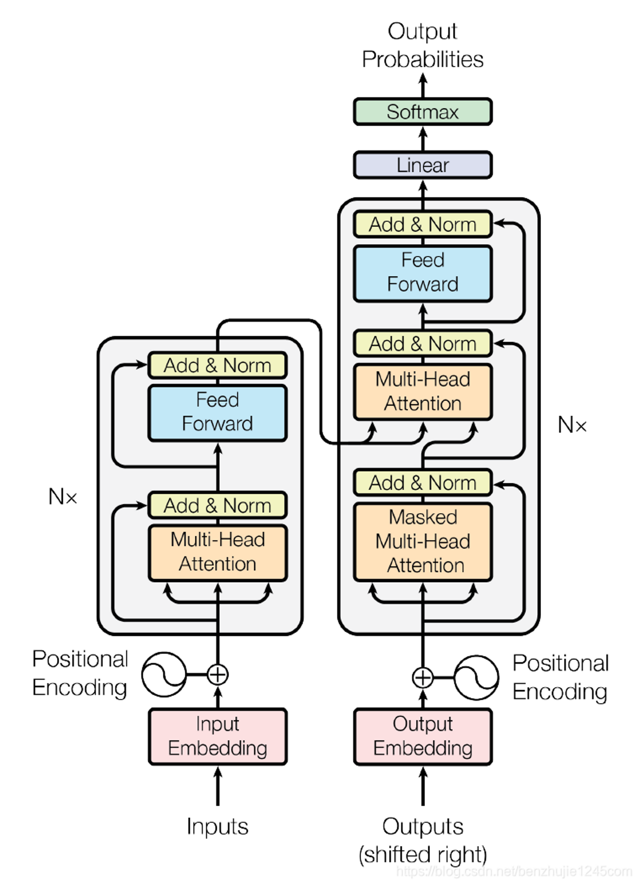

可以看到transformer的结构十分复杂，但是不用急，我们一步一个模块讲解。

首先，左边的模块如下图所示，叫做编码器（encoder）。
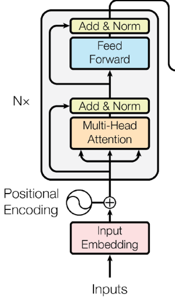
那右边的叫做解码器(decoder)。
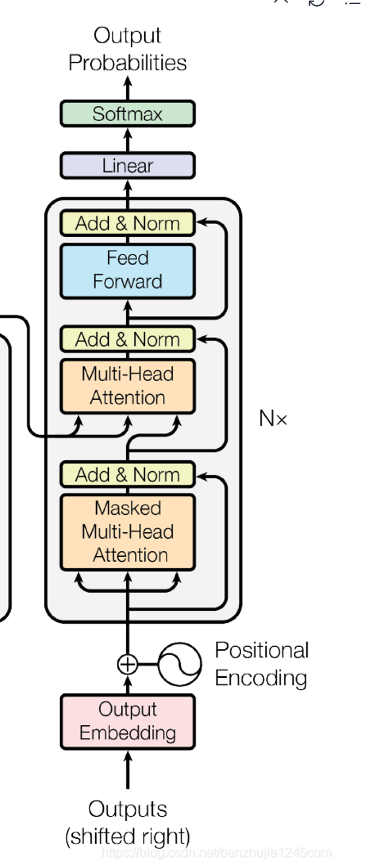
我们首先看编码器部分，从下到上。
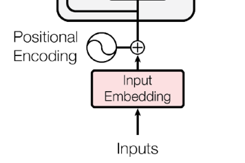

# 二编码器部分

负责处理输入序列，编码器和解码器都包含相同的模块

## 一、编码器输入

### 1.input Embedding

inputs,即我们输入的句子文本,Enbedding,直译为嵌入，就是把句子文本转换为向量。词嵌入通过将单词映射到低维向量空间中解决了传统编码的无法捕抓语义信息和维度灾难的问题。

将输入序列（Inputs）的 Tokens 转换为固定维度的向量表示（Input embedding），使模型能够处理文本数据。

翻译为大白话就是经过词嵌入后，我们的句子文本被转换为向量，相近意思的词比如说king和man，它们在向量空间里面的距离会比king和gril更加相近。这样处理的句子文本，能够更好的捕获语义信息，从而提高模型的性能。
常见的词嵌入模型有 Word2Vec、GloVe、FastText 等。它们都是训练得到的。

下面是简单的代码演示用于理解：

```python
class SimpleEmbedding(nn.Module):
    def __init__(self, vocab_size, d_model):
        super(SimpleEmbedding, self).__init__()
        # 初始化token嵌入
        self.token_embedding = nn.Embedding(vocab_size, d_model)
        # 初始化位置嵌入
        self.position_embedding = nn.Embedding(50, d_model)  # 假设最大序列长度为50

    def forward(self, x, position_ids):
        # x是token的索引，position_ids是位置索引
        # 获取token嵌入
        token_embeddings = self.token_embedding(x)
        # 获取位置嵌入
        position_embeddings = self.position_embedding(position_ids)
        # 将token嵌入和位置嵌入相加
        embeddings = token_embeddings + position_embeddings
        return embeddings

```

位置嵌入的部分在下面，现在可以先假装看不到，看完了位置编码我们就可以看到了。

### 2.Positional Embedding 位置编码

#### 1.为什么我们需要位置编码？

在序列模型中，每个位置的输入都是相互独立的，所以模型无法捕获到位置信息。因此，我们需要一种方法来表示每个位置的相对位置信息，以增强模型的性能。

还是举一个简单的例子，比如一句话我要输入到模型中，我输入的是：

```python
"I am a student."
```

它们在Embedding之后是一个矩阵，模型无法判断“I”在什么位置，所以需要位置编码。

而像RNN等循环神经网络，它的输入天生就自带有时序信息，所以不需要位置编码。

#### 2.位置编码的实现

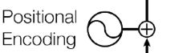

我们会使用正弦余弦函数来为每个位置生成一个位置编码向量。

$$
PE_{(pos,2i)} = \sin\left(\frac{pos}{10000^{2i/d_{\text{model}}}}\right),
$$

$$
PE_{(pos,2i+1)} = \cos\left(\frac{pos}{10000^{2i/d_{\text{model}}}}\right).
$$

其中，pos表示位置，d_model表示模型的维度，一般设置为512。

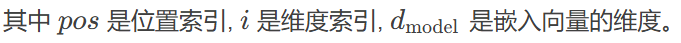
当然这样子显得不够大白话，对新手来说不好理解，我们用一个简单的例子来说明一下。

假设下面是已经被Embedding后的句子向量。也就是词嵌入后的句子。

```python
"Hello world"
```

| 单词        | 词嵌入向量   |
| --------   | -----:  |
| Hello     | \[0.1, 0.2, 0.3, 0.4]|
| world       |   \[0.1, 0.2, 0.3, 0.4]   |

接下来，我们为每个单词生成位置编码。假设句子长度为2，嵌入维度为4，使用正弦位置编码公式

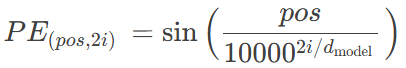

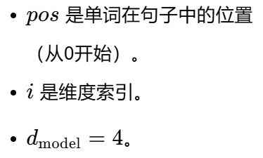

那么我们可以开始计算位置编码：

##### pos=0（就是第一个单词hello）

PE(0,0)=sin(0)=0

PE(0,1)=cos(0)=1

PE(0,2)=sin(0)=0

PE(0,3)=cos(0)=1

因此，位置0（hello）的编码向量为：[0,1,0,1]。

##### 对于位置 pos=1(world)

$$
PE(1,0) = \sin\left(\frac{1}{10000^0}\right) = \sin(1) \approx 0.8415
$$

$$
PE(1,1) = \cos\left(\frac{1}{10000^0}\right) = \cos(1) \approx 0.5403
$$

$$
PE(1,2) = \sin\left(\frac{1}{10000^1}\right) = \sin(0.0001) \approx 0.0001
$$

$$
PE(1,3) = \cos\left(\frac{1}{10000^1}\right) = \cos(0.0001) \approx 1
$$

因此，位置1的编码向量为：[0.8415,0.5403,0.0001,1]。

#### 3.位置编码的加法

现在，我们将词嵌入向量与位置编码向量逐元素相加，得到最终的输入向量：

| 单词        | 词嵌入向量   |  最终的输入向量   |
| --------   | -----:  |-----:  |
| Hello     | \[0.1, 0.2, 0.3, 0.4]|[0.1, 1.2, 0.3, 1.4] |
| world       |   \[0.1, 0.2, 0.3, 0.4]   |[1.3415, 1.1403, 0.7001, 1.8]|

<u> 恭喜你已经成功学会了位置编码 </u>

## 二、多头注意力机制

### 1. 什么是注意力机制

它就像给模型一个聚光灯，让它能够集中注意力在输入序列的某些部分，同时忽略其他部分，就像你们们人类在理解句子时关注特定的单词或短语一样。

它有三个重要的**可训练矩阵**，分别为**查询（Q）、健（K）和值（V）**。

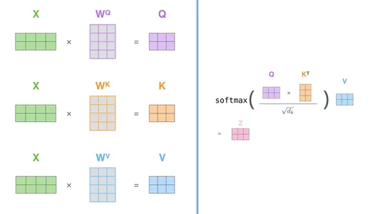

Q、K和V矩阵的维度应该满足以下条件：

- Q和K矩阵的维度应该相同，即Q和K矩阵的维度应该为(d_model, d_model)。
- V矩阵的维度应该与Q矩阵的维度相同，即V矩阵的维度应该为(d_model, d_model)。

其中，X为输入序列。

这样，我们就可以计算注意力权重，并通过注意力权重对V矩阵进行加权平均，得到最终的输出。

它通过Q和K矩阵计算注意力权重，比如考虑一句话：

```python
"I am a student."
```

Q与K的点积会得到一个权重矩阵，比如上述这句话，“student”这个单词的权重会比“I”、“am”、“a”等等单词的权重大，再与V矩阵进行加权平均，得到最终的输出。在最终的输出中，student这个单词的权重会比I、am、a等等单词的权重大。就实现了句子的关注。

当然**Q、K、V矩阵是通过训练得到，在训练过程中，模型会根据训练数据来学习得到这些矩阵。**

<u>恭喜你已经学会了注意力机制</u>

### 2.什么是多头注意力机制

#### 为什么我们要用多头注意力机制

在单头注意力机制中，模型会计算“fox”与句子中每个单词的关联度，然后生成一个单一的注意力分布。这个分布可能表明“fox”与“quick”、“brown”、“jumps”、“over”、“lazy”和“dog”都有关联，但模型可能难以同时捕捉到“fox”的颜色（“brown”）和动作（“jumps”）以及它所跳过的对象（“dog”）之间的复杂关系。

在多头注意力机制中，模型可以并行地执行多个注意力计算。例如：
头1：可能专注于物理属性，识别出“fox”和“brown”之间的关系。
头2：可能专注于动作，识别出“fox”和“jumps”之间的关系。
头3：可能专注于动作的目标，识别出“jumps”和“over”以及“dog”之间的关系

#### 如何实现多头注意力机制

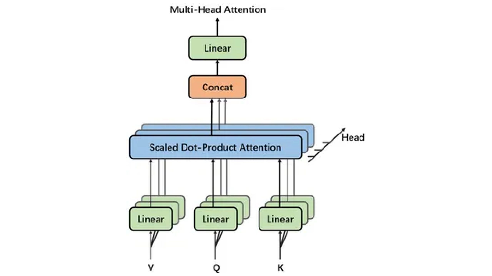

***首先是输入***

我们会让输入X经过一个线性变换，输入序列经历可学习的线性变换，将其投影到多个较低维度的表示，称为“头”

还是举个例子：

| 单词        | 词嵌入向量   |
| --------   | -----:  |
| Hello     | \[0.1, 0.2, 0.3, 0.4]|
| world       |   \[0.1, 0.2, 0.3, 0.4]   |

经过一个线性变换，得到：

| 单词        | 词嵌入向量   |
| --------   | -----:  |
| Hello     | \[[0.1, 0.2, 0.3, 0.4],[0.1, 0.2, 0.3, 0.4]]|
| world       |   \[[0.1, 0.2, 0.3, 0.4],[0.1, 0.2, 0.3, 0.4]]   |

这样子就得到了两个头，对于QKV矩阵其原理也是一样的。独立的计算每个头的注意力权重，再进行加权平均，得到最终的输出。然后将来自所有头的注意力输出被连接（Concat）并线性投影回原始维度。这个过程将来自多个头的见解结合起来，这就增强了模型理解序列内复杂关系的能力。

<u>恭喜你双又已学会了多头注意力机制</u>

## 三、前馈网络(FeedForward)


前馈网络就是一个线性变换，然后经过一个激活函数，再经过一个线性变换，最后得到一个输出。

前馈网络几乎是Transformer中是最简单的结构了。
下面是简单的代码演示：

```python
class FeedForward(nn.Module):
    def __init__(self, d_model, d_ff, dropout=0.1):
        super(FeedForward, self).__init__()
        self.linear1 = nn.Linear(d_model, d_ff)
        self.linear2 = nn.Linear(d_ff, d_model)
        self.relu = nn.ReLU()
     def forward(self, x):
        # 线性变换1
        x = self.relu(self.linear1(x))
        
        
        return x
```

它经过两个全连接层（线性层）再经过一个激活函数（ReLU）就是一个前馈网络（Feed-Forward Network，FFN）。

**那前馈网络有什么作用呢**

前馈网络”（Feed-Forward Network，FFN）这个术语来源于神经网络中信息流动的方向。

这个前馈网络的目的是为模型提供额外的非线性变换能力，让模型更好地学习输入数据的复杂特征。在Transformer中，前馈网络具有很大的的维度，例如，如果模型的维度（d_model）是512，前馈网络可能会将输入先映射到一个更高维度的空间（如2048，这个维度有时称为d_ff或d_hidden），应用一个非线性激活函数，然后再映射回原始维度（512）。这种结构有助于模型捕获更丰富的特征表示

## 三、残差连接与归一化

### 什么是残差连接

大家不要被**残差**这个高大上的名称吓到chinese，**残差**这个词的意思是**残差**，残差连接就是残差。

残差连接就是将输入和输出进行相加，这样子，模型就可以学习到输入和输出之间的联系，从而提高模型的性能。

残差连接的实现的简单代码如下：

```python
ResidualConnection(nn.Module):
    def __init__(self, input_dim, output_dim):
        super(ResidualConnection, self).__init__()
        
        self.linear = nn.Linear(input_dim, output_dim)
    
    def forward(self, x):
        # 计算线性层的输出
        output = self.linear(x)
        # 实现残差连接：将输入直接加到输出上
        return output + x

```

没错就是将输入和模型输出相加就得到了残差连接。

### 层归一化（Layer Normalization）

### 1.为什么要归一化

#### 改善梯度流

众所周知，在大模型的训练中存在连个拦路虎，它们分别是**梯度消失**和**梯度爆炸**。
梯度消失和梯度爆炸都是由于神经网络的权重更新规则导致的，而层归一化则是一种新的权重更新规则，它通过归一化层内的特征向量来防止梯度消失和梯度爆炸。

#### 能支持更深层的网络

层归一化使得训练更深层的网络成为可能。在深层网络中，内部协变量偏移问题更加严重，而层归一化通过归一化每一层的输入来缓解这个问题。

#### 加速训练

通过归一化，层归一化确保了每一层的输入具有稳定的分布，从而加快了收敛速度。

### 2.如何进行层归一化

**计算均值和方差**：对于每个样本，计算其所有层的均值和方差。
**归一化**：使用计算出的均值和方差对每个样本的层进行归一化。
**缩放和平移**：通过可学习的参数对归一化后的层进行缩放和平移，以恢复模型的表达能力。

下面是代码演示

```python
class LayerNorm(nn.Module):
    def __init__(self, features, eps=1e-6):
        super(LayerNorm, self).__init__()
        self.gamma = nn.Parameter(torch.ones(features))
        self.beta = nn.Parameter(torch.zeros(features))
        self.eps = eps

    def forward(self, x):
        mean = x.mean(-1, keepdim=True)
        var = x.var(-1, keepdim=True)
        x = (x - mean) / torch.sqrt(var + self.eps)
        return self.gamma * x + self.beta

```

好了看到这里你已经对transformer的编码器有了一个比较好的理解了，**恭喜你坚持到现在！**

#  解码器（decoder）部分

解码器的功能是解码器的主要功能是生成输出序列，同时注意到输入序列的相关部分和先前生成的标记。它利用输入序列的编码表示来理解上下文，并对生成下一个标记做出明智的决策。

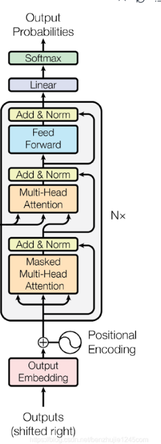

对于解码器，其大部分的逻辑和编码器是一样的，唯一不同的是，解码器需要处理一个额外的输入序列，这个输入序列是目标序列，这个序列是模型需要生成的序列。

下面是解码器和编码器的训练和推理流程。以翻译任务（英语翻译法语）为例：

```python
输入句子（英语）：The quick brown fox
目标句子（法语）：Le rapide renard brun
```

#### 首先是**训练流程**

我们来看**编码器**的**输入**：

- 源序列为：The quick brown fox
- 经过嵌入和位置标记。

编码器的**输出**：

- 编码器的输出为一个矩阵。输入到解码器中

我们再看**解码器**的**输入**：

- 原序列为目标句子：Le rapide renard brun
- 经过嵌入和位置标记。

- 还有编码器的输出

解码器的输出是一个序列，每个标记都是模型根据编码器的输出和目标序列生成出来的。即为目标句子

#### 我们再看**推理流程**

**编码器的输入**和训练时的一样

主要是**解码器的输入**不一样：

- 输入起始标记< s >,解码器从句子的开始标记开始生成。
- 逐步生成，与自回归模型原理一样，解码器在每一步生成一个词，并将其反馈到解码器中，作为下一步的输入。例如，如果第一步生成了 "Le"，则第二步的输入将包括 "Le" 的嵌入和位置编码
- 编码器的输出作为解码器的输入
- 停止条件：生成过程继续进行，直到生成句子的计数标记如< /s >,或者达到预设的最大长度
  
  我们可以看到，解码器在训练和推理时，都使用了相同的输入和输出，只是训练时使用了目标序列作为标签，推理时没有目标序列，而是根据编码器的输出和目标序列生成下一个标记。

  
