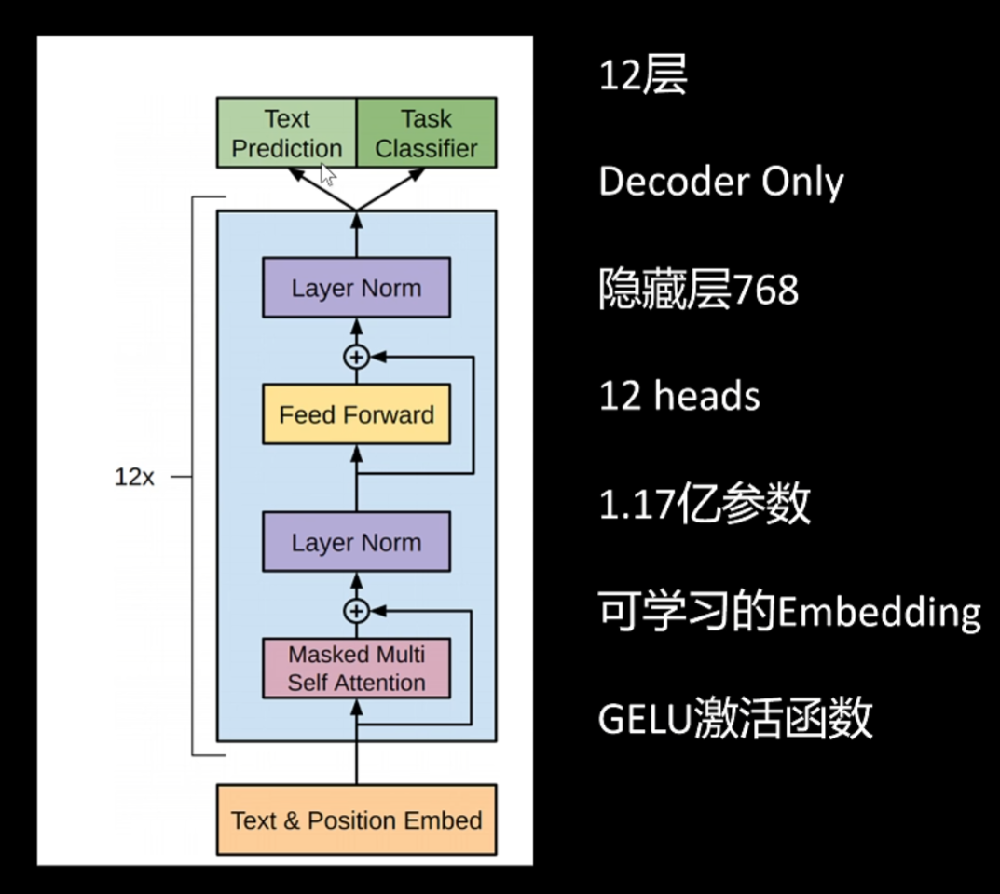
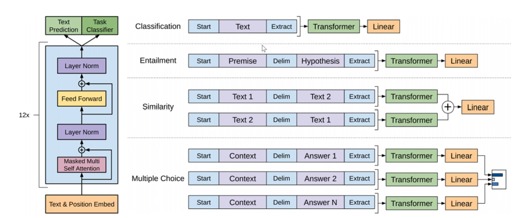
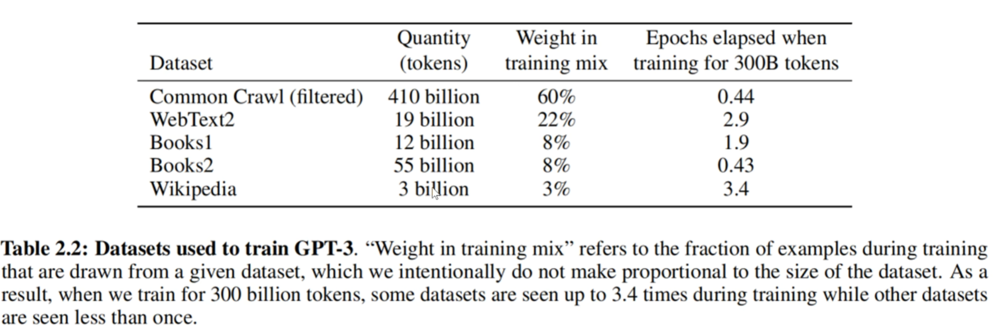

# GPT系列的发展

## 一、GPT-1 ：通过生成式的预训练改进自然语言

### GPT-1的动机

当时每个NLP任务都需要大量的标注数据，模型不能复用，当时的CV领域得益于imageNet训练集，有预训练模型，可以针对下游任务使用少量数据进行微调预训练模型，节省时间精力。

openAI得到灵感，提出要做一个NLP领域的预训练模型。

### 做一个预训练模型的难点

- 1.**没有像imagenet的大量的数据集**
- 2.**预训练模型架构轻微修改就能应用到下游任务，比如说现在的加一个分类头。模型的架构如何设计。**

**解决**：

- 1.**没有大量的标注数据集：** 采用语言模型自回归的方式对语料进行无监督训练的方式来进行训练模型，输入一段文本，让模型根据之前的文本来预测下一个字的方式来进行训练。
- 2.**模型架构如何设计：** OpenAI在RNN和transformer中选择了transformer架构，因为它们发现transformer能更好的记住训练数据的模式，也能很好的迁移到下游任务。openAI选择了transformer中的decoder架构，并且做出了简化，去掉了交叉注意力机制的部分

### GPT-1的微调模式

有了预训练模型，就可以对预训练模型进行微调来应用到下游任务中。

OpenAI的微调模式是在输入的文本token前加一个特殊的token来进行具体的任务，模型会根据输入的特殊token来改变任务进行训练。

在预训练中，GPT—1不仅进行下游任务训练，还进行自回归的训练，两个训练方式使用不同的损失权重一起训练模型。

### GPT-1的训练数据

使用了BooksCorpus dataset,包括70000本未发表的书，有800M个单词。上下文长度为512，batch size为32

### Bert

在GPT-1发布不久，bert出现了，与GPT-1不同，它采取了transformer中的encoding架构来继续语义提取，同时采用的双向的策略，对于一个token，会考虑它之前的token，以及之后的token，这种策略更适合做语义提取，在传统NLP任务上全面优于GPT-1。

## 二、GPT-2语言模型是非监督的

### GPT-2的动机

GPT-1和Bert将预训练模型引入了NLP领域，但是下游任务仍然需要收集一部分数据进行微调，GPT-2希望预训练模型能够解决所有任务。

### 引入prompt

在GPT-1中，模型的输入输出可以表示为：f(x) = p(outputs|inputs)
在GPT-2中我们就可以这么表示：f(x) = p(outputs|inputs, prompt)

比如对于语义理解的任务，我们可以这么输入：

GPT-2：*提取出用户想吃什么：我先吃水饺！*

输出就是：水饺

### GPT-2模型架构的改变

- 1.将Layer Norm移动到每个block输入的位置，之前是先注意力在Layer Norm，让训练更加稳定。在最后一个子层的自注意机制后添加了layer norm
- 2.残差层的的初始化参数随层数的增长而减少，利于梯度向前传递，初一根号下N，N为残差层的层数。
- 3.扩大词典到50257
- 4.模型参数达到15.42亿（1.5B参数）

### GPT-2训练的修改

- 1.上下文长度从512到1024
- 2.batch_size从32到512
- 使用了Reddit的优质网页，800万文本，50GB的文字
  
### GPT-2的性能

虽然GPT-2在许多任务里面表现出了不错的性能，但是无法远远碾压其他通过监督训练得到模型，但OpenAI发现随着模型的增大，性能提升的空间很大，所以有了GPT-3的出现。

## 三、GPT-3：语言模型可以通过几个样本学习

### GPT-3的动机

人类在做一个语言任务时，只要给出几个例子就可以，但是传统的Bert、GPT-1还需要许多数据来进行微调训练。能否通过在prompt中加入一些例子，来提升模型的性能。（few shot）同时延续GPT-2的思想，将模型继续做大做强。

### 各种shot

- 1.zero shot：不给出样例，给出指令直接让模型进行输出。
- 2.one-shot：给出一个样例，让模型根据样例进行输出。
- 3.few-shot：给出几个样例，让模型根据样例进行输出。

### 模型架构的修改

和GPT-2一样，但是引入了稀疏注意力机制，原本每个token和前面所有token做注意力机制，现在只对前面的部分的token做注意力机制

### GPT-3的训练数据

GPT-3最大的模型参数为175B，在3000亿个tokens的训练数据上训练。

训练时的上下文长度为2048，Batch size为恐怖的320万。

### GPT-3的性能

175B的模型的few-shot性能比经过微调的模型要高了。

## 四、GPT-4：多模态大模型

GPT-4的技术报告并没有透露出更多有用的内容，有用的见解是：模型的能力是在预训练时获得的，RLHF只是和人类偏好对齐，并不能提高模型的表现，如果RLHF做的不好，还可能会破坏原有的能力。

openai还有一个独门秘诀，要评估一个大模型的性能，我们还可以训练一个相同架构的但是参数量小很多很多的模型来评估大模型的性能。
