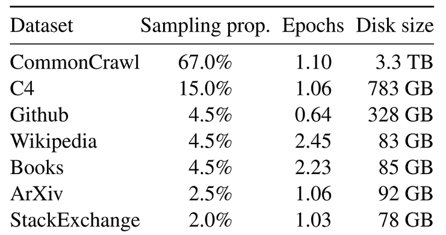

# Llama:开源的急先锋

## Llama1：开放、高效的基础语言模型

Llama1使用了完全开源的数据，性能媲美GPT-3，可以在社区研究开源使用，只是不能商用。

### Llama1提出的Scaling  Law

业内普遍认为如果要达到同一个性能指标，训练更大大模型会更划算，因为训练的成本会降低，较大的模型会更快的收敛，但是llama不这么认为，llama认为虽然训练成本会降低，但是推理的成本会提高，推理代价会比训练代价更加重要。

Llama还建议10B的模型用200B的token训练，相同的计算预算，增加训练数据比扩大模型有效。

### llama1的训练数据

Llama1使用公开渠道获取的数据
对CommonCrawl（2017-220）数据集进行了去重，去除非英文数据，使用线性模型进行质量分类过滤。书和维基百科训练了两个epoch，其他则是一个。
上下文长度为2048，2048个A100-80G GPU，训练21天。

注：
Common Crawl 是一个非营利性组织（501(c)(3)），由 Gil Elbaz 于 2007 年创立。它通过大规模分布式爬虫系统定期抓取互联网上的网页数据，并将这些数据免费提供给公众。

自 2008 年以来，Common Crawl 已积累了数十亿个网页，数据量达数十 PB。每月都会进行一次爬取

### llama1的模型结构

和GPT一样使用了transformer的Decader架构，做出以下修改：

1. 和GPT3一样将Normalization从每个子层的输出位置移动到了输入位置
2. 将Layer Norm改为RMS Norm
3. 采用了旋转位置编码
4. 采用了silu激活函数，可以提高精度，计算代价较高。

## 二、Llama2：开放的基础的微调聊天模型

相比Llama1：Llama2更加open，它可以用于商用，训练的数据量更大，训练了ChatModel，对标chatGPT。

### Llama2的训练

Llama2的训练数据比Llama1多了40%，达到了2Ttoken，训练上下文从2048增加到4096，训练了172万个GPU小时，相当于2048个GPU训练35小时。

使用10万条监督数据进行监督微调，使用了100万条人类偏好数据进行强化学习。

训练流程：
在大量文本上进行自回归的预训练-->使用监督数据进行监督微调-->使用人类偏好数据训练安全奖励模型和有用奖励模型对模型进行强化学习训练-->Llama2-chat

### Llama2的模型架构

1. 引入了GQA（分组查询注意力机制）

## 三、Llama3：开源的微调聊天模型

目标：做最好的开源大模型，可以和最好的商用大模型媲美。

### Llama3的模型架构

字典从三万两千个token扩充到12万八千个token。扩充四倍，原来一个中文被编码成多个token，现在一个中文被编码成一个个token。提高了推理效率
采用GQA（分组查询注意力机制）
训练时的训练长度从4096扩充到8192

### Llama3的训练数据

训练数据采用了15T的token的数据集，全部来自公开数据，是llama2的7倍大小，同时代码数据也多了四倍。由研究表明代码数据可以增强模型的推理能力。
数据集中有5%的高质量非英语数据，涵盖30多种语言，对数据进行了清洗过滤，由Llama2生成训练数据来帮助训练文本分类器，微调阶段处理开源数据集，还人工标注了1000万样本。

### 缩放定律

制定了一系列缩放定律，通过小模型表现可以在大模型训练前预测大模型的表现。

根据之前Scaling Law推算8B模型对应2000亿Token，但是Meta发现即使15万亿Token训练，性能还可以提升。

在两个定制的24k GPU集群上训练。有效训练时间超过95%，比Llama2提高了3倍。

| 模型       | 训练（GPU小时） | GPU       | 训练Token |
|------------|----------------|-----------|-----------|
| Llama1 65B  | 1.0M           | A100 80G   | 1.4万亿   |
| Llama2 70B  | 1.7M           | A100 80G   | 2万亿     |
| Llama3 70B  | 7.7M           | H100 80G   | 15万亿    |

### 指令微调

从Llama2-chat到Llama3-Instruct，可以看出现在的模型不仅仅是用来聊条，更多的是做指令跟随。

指令微调用到了SFT、拒绝采样、PPO、DPO
