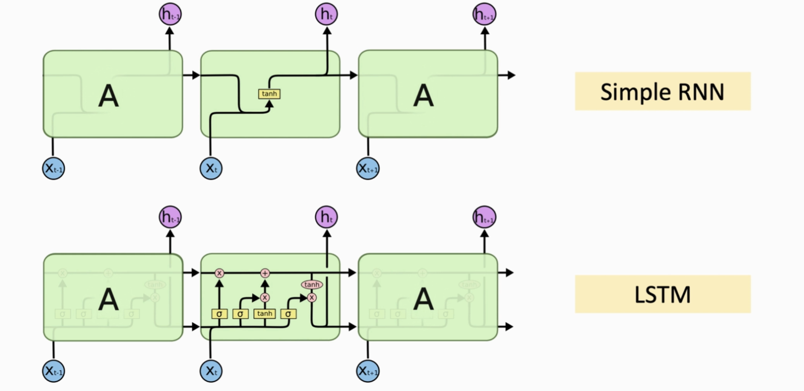
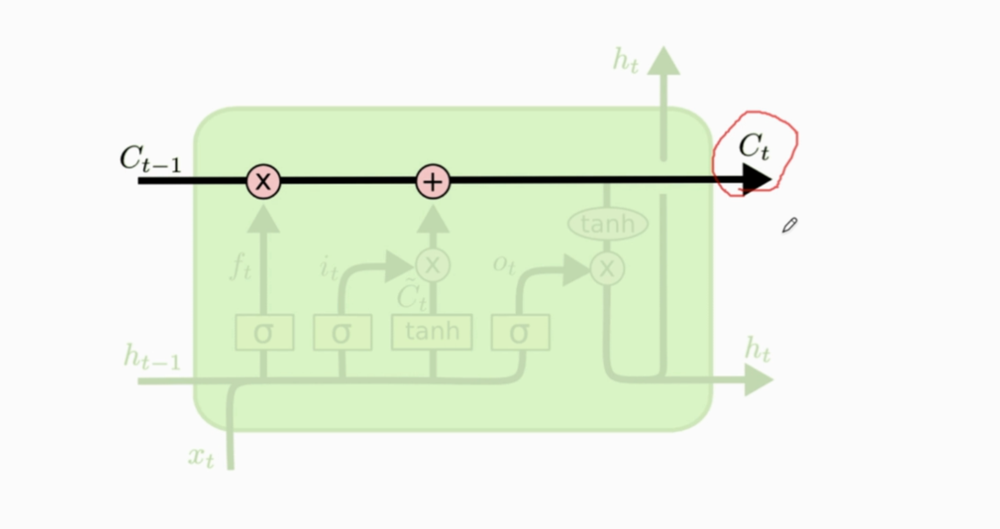
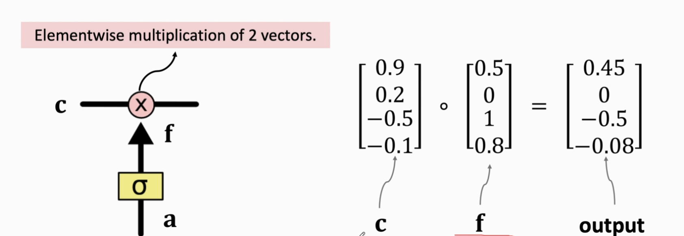
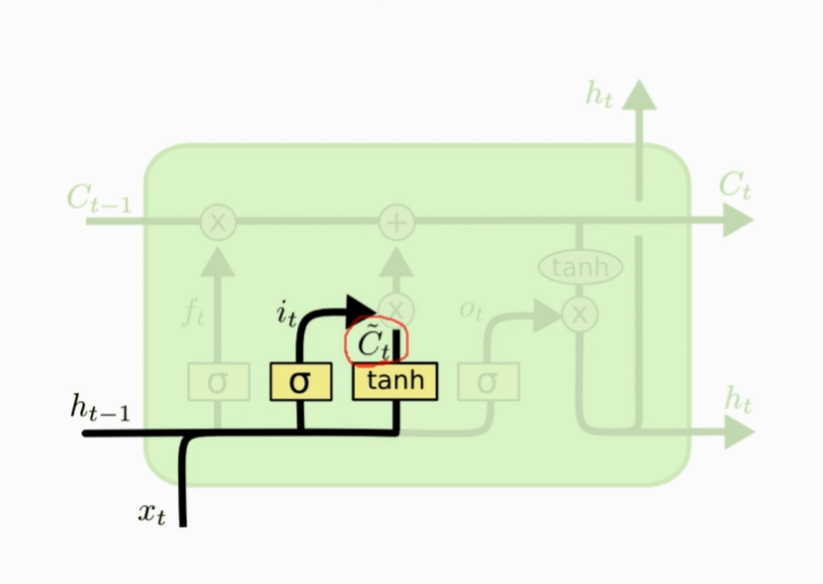
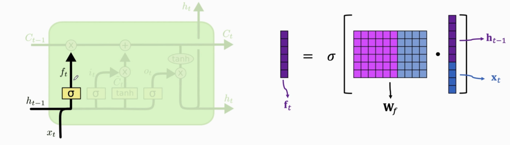
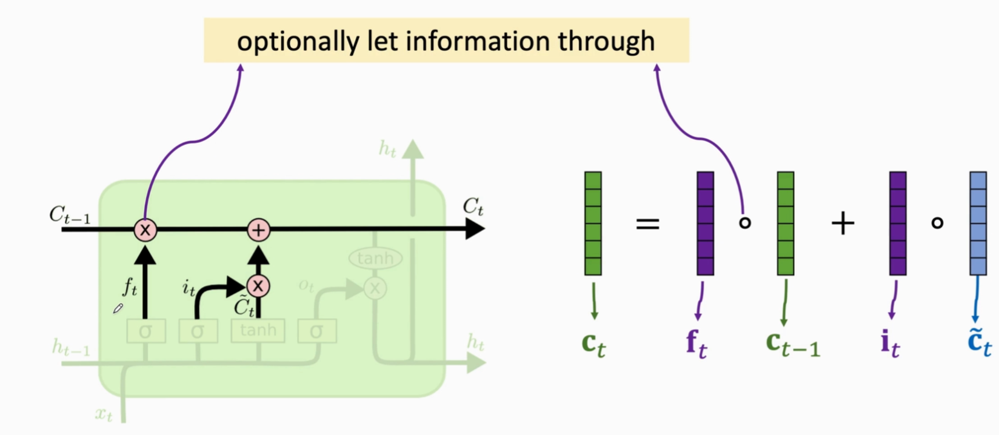
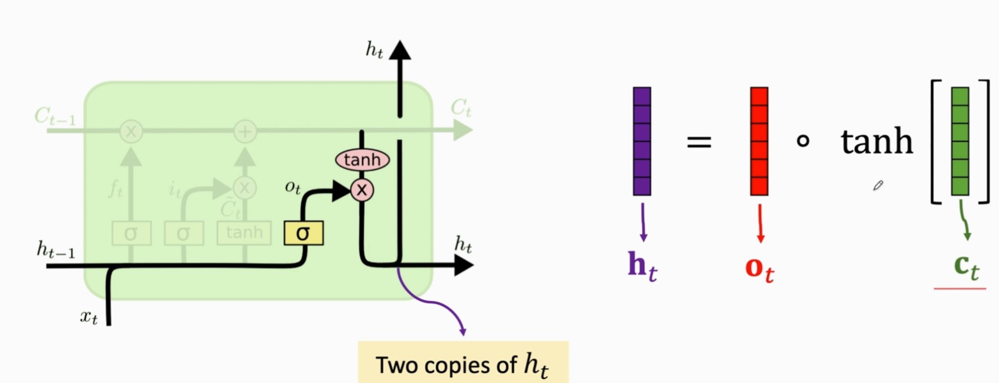

# LSTM

长短期记忆网络（Long Short-Term Memory, LSTM）是一种特殊的循环神经网络（Recurrent Neural Network, RNN），它解决了传统RNN在处理长时间序列时遇到的梯度消失和梯度爆炸问题。LSTM通过引入特定的门控机制来控制信息流，使得网络能够在长时间间隔内保持信息的记忆。

## 1.LSTM的核心概念



LSTM 和 RNN 类似，也有状态矩阵$h_t$(下面这条)，但LSTM具有更复杂的内部结构，以解决传统RNN的梯度消失和梯度爆炸问题。RNN只有一个参数矩阵，而LSTM有四个参数矩阵：

1. **细胞状态（Cell State）**：这是LSTM的关键部分，可以看作是一条贯穿整个链的信息传输线。信息在此线上流动时只经过少量的线性变换，因此能够长期保存信息。

2. **门（Gates）**：LSTM使用三种类型的门来调节信息流：

**遗忘门（Forget Gate）**：决定哪些信息从细胞状态中丢弃。

解释： $\sigma$ 函数将$f$矩阵映射到0到1之间，$f$与传输带$C$对应元素相乘，从而实现信息过滤。

**输入门（Input Gate）**：决定哪些新信息将被加入到细胞状态中。
其结构和遗忘门一样。

其结构和遗忘门一样。不一样的是激活函数选择的是**tanh函数（使得输出介于-1到1之间**。
**输出门（Output Gate）**：决定根据当前的细胞状态输出什么信息。
其结构和遗忘门一样。

这些门都由一个sigmoid层和逐点相乘操作组成，sigmoid层输出0到1之间的值，表示对应信息的重要性或保留比例。

## 2.LSTM的工作流程

**遗忘门**首先决定哪些旧信息需要忘记，这通常基于当前时间步的输入以及前一时间步的隐藏状态。


**输入门**然后确定哪些新信息应该被记住，并更新细胞状态。

$f_t$可以选择遗忘$C_{t-1}$中的元素

最后，**输出门**生成新的隐藏状态，这部分基于更新后的细胞状态。


### 应用领域

LSTM因其能有效捕捉序列数据中的长期依赖关系，在多个领域得到了广泛应用：

- **自然语言处理（NLP）**：包括语言建模、情感分析、文本生成等任务。
- **语音识别**：用于将语音信号转换为文本。
- **图像分类与目标跟踪**：尽管LSTM主要用于处理序列数据，但也可以与其他模型如卷积神经网络（CNN）结合应用于图像领域。
- **时间序列预测**：例如股票价格预测、气象预测等。

### 实际应用示例

在实际应用中，LSTM可以通过Python库如PyTorch或TensorFlow来实现。以下是一个简单的例子，展示了如何在PyTorch中定义一个LSTM模型：

```python
import torch.nn as nn

class LSTMModel(nn.Module):
    def __init__(self, input_dim, hidden_dim, layer_dim, output_dim):
        super(LSTMModel, self).__init__()
        self.hidden_dim = hidden_dim
        self.layer_dim = layer_dim
        self.lstm = nn.LSTM(input_dim, hidden_dim, layer_dim, batch_first=True)
        self.fc = nn.Linear(hidden_dim, output_dim)

    def forward(self, x):
        h0 = torch.zeros(self.layer_dim, x.size(0), self.hidden_dim).requires_grad_()
        c0 = torch.zeros(self.layer_dim, x.size(0), self.hidden_dim).requires_grad_()
        out, (hn, cn) = self.lstm(x, (h0.detach(), c0.detach()))
        out = self.fc(out[:, -1, :])
        return out
```

在这个例子中，`LSTMModel` 类包含了LSTM层和全连接层。LSTM层接受输入维度、隐藏层维度、层数以及批次优先的标志作为参数，而全连接层则将LSTM的最终输出映射到期望的输出维度。

综上所述，LSTM作为一种强大的深度学习工具，为处理序列数据提供了有效的解决方案，并且随着技术的发展，其应用范围也在不断扩大。, , , , , , , , 