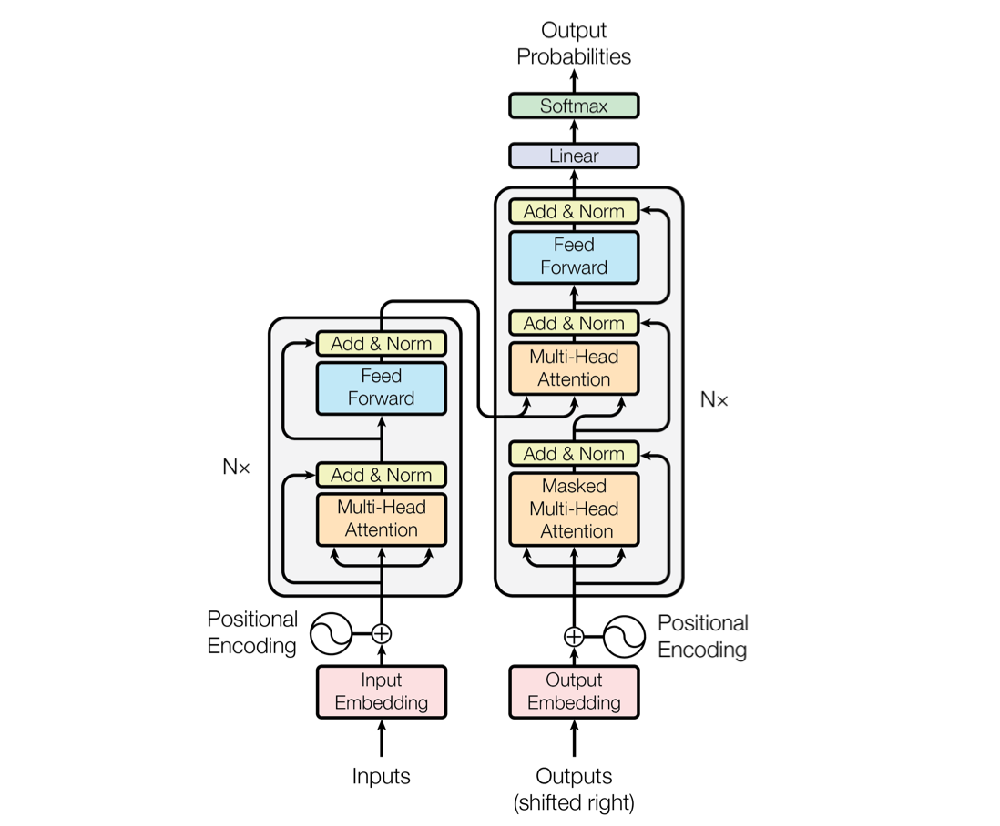
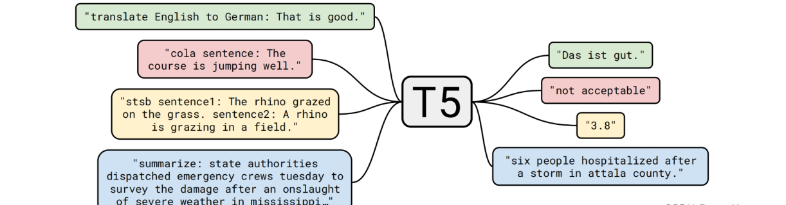
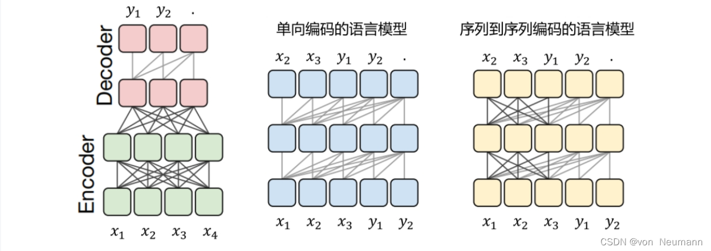
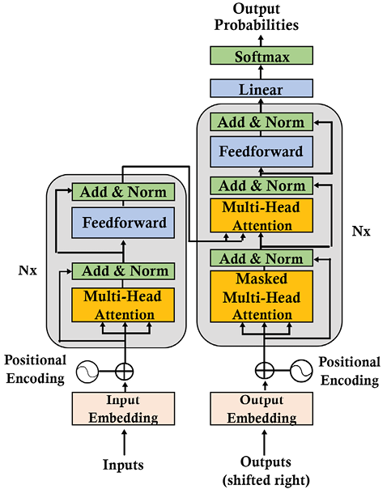
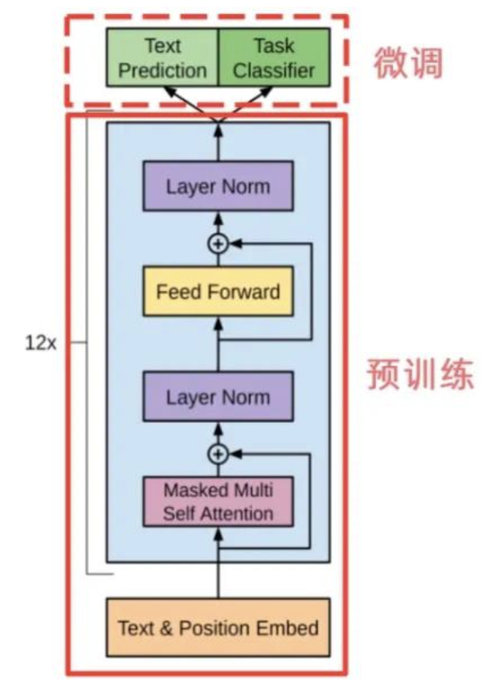
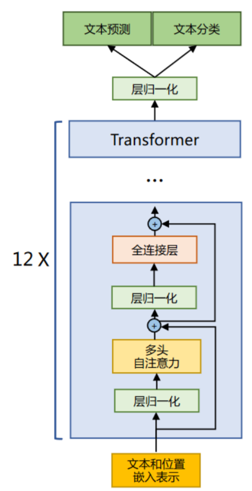
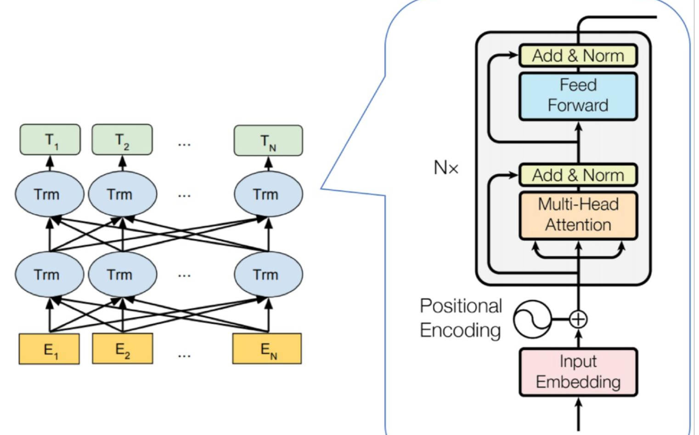

# 基于transformer的各种模型

## 一、encoder-decoder 模型

### 1. 原始transformer架构

2017年， 原始Transformer模型引入了自注意力机制、位置编码和多头注意力等突破性概念。它使用编码器-解码器架构来处理序列到序列的学习，其性能优于之前的序列到序列(S2S)模型


详细介绍请看[Transformer新手教程附有简易教学代码](https://github.com/KangkangLoveNLP/Facing-the-most-basic-tutorial-for-beginners-on-large-models/tree/main/Transformer)

### 2.T5 模型（2020）

T5模型（ext-to-Text Transfer Transformer）是Transformer模型的一个变体，它使用一个共享的编码器和解码器，并使用一个共享的词表来处理不同任务的多任务学习。T5模型在自然语言处理领域获得了很好的性能，并得到了广泛的应用。

T5T5模型采用Transformer的encoder-decoder结构，与原始Transformer结构基本一致，但做了一些改动，例如简化版本的Layer normalization，其中激活只是重新调整，没有附加偏差被应用。编码器和解码器层成为块（block），子层为包含自注意层和前馈网络的子组件（subcomponent）。在Layer normalization之后，将一个residual的skip connection将每个子组件的输入添加到其输出中



T5在结构选型时考虑了3种模型结构，如下图所示，分别是Encoder-Decoder结构（传统的Transformer结构）、Decoder结构（GPT的结构）和Prefix LM结构（UniLM的结构）


T5对这3种模型结构均做了测试，发现Transformer Encoder-Decoder结构效果最佳，于是遵循实践出真知的法则，T5的模型结构采用了传统的Transformer结构。



### 3. BART模型（Bidirectional and Auto-Regressive Transformers）（2020）

BART使用了标准的序列到序列Transformer架构，但根据GPT的做法，将ReLU激活函数修改为GeLU，并从N(0, 0.02)初始化参数。对于基础模型，编码器和解码器各使用6层；对于大型模型，各使用12层。该架构与BERT使用的架构密切相关，但解码器的每一层额外对编码器的最终隐藏层执行交叉注意力

BART的训练方式为去噪自编码器任务，具体来说，它会对输入进行以下几种扰动：

**Token Masking**：像BERT一样，随机遮蔽一些词。
**Token Deletion**：随机删除输入序列中的一些词。
**Sentence Permutation**：打乱输入序列中句子的顺序。
**Document Rotation**：将输入文本的顺序进行旋转，改变句子的起始位置。

## 二、decoder-only 模型

Decoder-only模型的发展脉络可以追溯到Transformer模型的提出，它专注于生成文本，而不需要Encoder部分来编码输入序列。

### 1.GPT系列（Generative Pre-trained Transformer）（2018-至今）

GPT-1是由OpenAI在2018年6月发布的，它是基于Transformer架构，采用了仅有解码器的Transformer模型，专注于预测下一个词元。GPT-1在多种语言任务上展现出了优秀的性能，证明了Transformer架构在语言模型中的有效性。



### 2.LLama系列（Large Language Model Meta AI）(2023)

LLaMA所采用的Transformer结构和细节，与标准的Transformer结构不同的地方是包括了采用前置层归一化（Pre-normalization）并使用RMSNorm归一化函数（Normalizing Function）、激活函数更换为了SwiGLU，并使用了旋转位置嵌入（RoPE），整体Transformer架构与GPT-2类似。



## 三、encoder-only 模型

encoder-only模型，也称为自编码器模型，是一种基于Transformer架构的模型，它主要用于对输入序列进行编码，并生成相应的输出。与decoder-only模型不同，encoder-only模型没有解码器部分，因此它主要用于对输入序列进行编码，并生成相应的输出。

### 1.BERT（Bidirectional Encoder Representations from Transformers）（2018）

翻译过来就是 **来自 Transformer 的双向编码器表示**

BERT模型由Google在2018年10月发布。作为第一个双向处理上下文文本的深度学习模型，BERT 为各种 NLP 任务的大规模改进奠定了基础。

所谓的双向处理上下文文本，就是说，BERT 同时处理了句子的前后两个词，而不是只处理前向或后向。这种双向性使得 BERT 能够更好地理解词语的多义性。



我们可以举个例子，假设我们有一个句子：

```python
"The cat is sitting on the mat."
```

在单向编码中，每个词或标记的编码仅依赖于其之前的词或标记。因此，在编码“mat”这个词时，模型只会考虑“The”、“cat”、“sitting”和“on”这些在它之前的词。

在双向编码中，每个词或标记的编码都会同时考虑其前后的词或标记。因此，在编码“mat”这个词时，模型会考虑“The”、“cat”、“sitting”和“on”这些在它之前的词。从而更全面地理解整个句子的语义。

### 2.RoBERTa（Robustly Optimized BERT Pretraining Approach）（2019）

RoBERTa由Facebook AI在2019年7月提出，它在BERT的基础上进行了优化，包括更大的模型规模、更多的训练数据和更长的训练时间
RoBERTa（Robustly Optimized BERT Pretraining Approach）是由 Facebook AI Research（FAIR）提出的一种基于 BERT 的改进型预训练语言模型。以下是关于 RoBERTa 的详细介绍：

#### 核心原理

RoBERTa 在 BERT 的基础上进行了多项优化：

- **预训练任务的调整**：
  - **更高的遮蔽比例**：RoBERTa 使用了更高的遮蔽比例（例如 15%），相比 BERT 的默认遮蔽比例（15%），RoBERTa 在某些实验中尝试了更高的遮蔽比例（如 30%），以探索模型对更复杂语言模式的学习能力。
  - **动态遮蔽**：RoBERTa 在预训练过程中动态地选择遮蔽的单词，而不是固定地遮蔽特定比例的单词。这种动态遮蔽策略使得模型能够学习到更广泛的语言模式。
  - **不使用 [SEP] 和 [CLS] 标记**：RoBERTa 在预训练阶段不使用 [SEP] 和 [CLS] 标记，而是直接将句子拼接在一起，这使得模型能够更自然地处理文本。
- **输入文本的处理方法**：RoBERTa 使用更长的输入序列（1024 个词，BERT 通常为 512 个词）和更严格的随机遮蔽比例，使得模型能够学习到更丰富的语言特征。
- **微调技巧**：RoBERTa 在微调阶段引入了动态学习率调整和更灵活的注意力机制，提高了模型在特定任务上的表现。

#### 特点

- **架构**：RoBERTa 的架构与 BERT 相似，基于 Transformer 模型，包括一个双向的编码器和一个可选的解码器。
- **性能提升**：RoBERTa 在多个自然语言处理任务上表现出色，如机器翻译、问答系统和文本分类等，其性能优于 BERT。

#### 应用场景

RoBERTa 广泛应用于自然语言处理的多个领域，包括但不限于：

- **机器翻译**：在 WMT 英语-德语翻译数据集上，RoBERTa 的 BLEU 分数达到 27.7，相较于 BERT 的 25.3 有显著提升。
- **问答系统**：在 Stanford 问答数据集（SQuAD）上，RoBERTa 的准确率达到 85.5%，相较于 BERT 的 84.2% 有显著提升。
- **文本分类**：在 IMDb 电影评论数据集上，RoBERTa 的准确率达到 85.7%，相较于 BERT 的 84.9% 有显著提升。

#### 使用方法

要快速开始使用 RoBERTa 模型，可以按照以下步骤操作：

1. 安装必要的深度学习库，如 PyTorch 和 transformers：

   ```bash
   pip install transformers
   ```

2. 加载预训练的 RoBERTa 模型并执行任务，例如文本分类：

   ```python
   from transformers import RobertaTokenizerFast, RobertaForSequenceClassification
   tokenizer = RobertaTokenizerFast.from_pretrained('roberta-base')
   model = RobertaForSequenceClassification.from_pretrained('roberta-base')
   text = "这里是一条用于测试RoBERTa的示例文本。"
   inputs = tokenizer(text, return_tensors="pt")
   with torch.no_grad():
       outputs = model(**inputs)
       predicted_label = outputs.logits.argmax(dim=-1).item()
   print(f"预测类别是: {predicted_label}")
   ```

RoBERTa 通过优化预训练任务、改进输入文本处理方法和引入动态学习率调整等技巧，显著提升了模型的预训练效果和性能。

### 3.ELECTRA（Efficiently Learning an Encoder that Classifies Token Replacements Accurately）（2020）

ELECTRA由Google Brain和斯坦福大学在2020年3月提出，它采用生成器-判别器架构，通过Replaced Token Detection（RTD）任务进行预训练

## 总结

一是 **性能差异**

| 特性 | Encoder-Decoder | Encoder-Only | Decoder-Only |
|------|-----------------|--------------|--------------|
| **架构复杂度** | 高，包含编码器和解码器 | 中，仅编码器 | 中，仅解码器 |
| **参数效率** | 较低，需同时训练编码器和解码器 | 高，专注于输入编码 | 高，专注于输出生成 |
| **生成能力** | 强，适合序列到序列任务 | 弱，无法直接生成文本 | 强，适合创造性写作 |
| **理解能力** | 强，能捕捉输入输出的复杂关系 | 强，双向编码 | 弱，单向生成 |
| **训练难度** | 高，需要大量数据和计算资源 | 中 | 中 |

二是 **应用场景**

| 应用场景 | Encoder-Decoder | Encoder-Only | Decoder-Only |
|----------|-----------------|--------------|--------------|
| **机器翻译** | ✔️ | ✖️ | ✔️ |
| **文本摘要** | ✔️ | ✖️ | ✔️ |
| **文本分类** | ✖️ | ✔️ | ✖️ |
| **情感分析** | ✖️ | ✔️ | ✖️ |
| **对话生成** | ✔️ | ✖️ | ✔️ |
| **文本续写** | ✖️ | ✖️ | ✔️ |
| **问答系统** | ✔️ | ✔️ | ✔️ |
