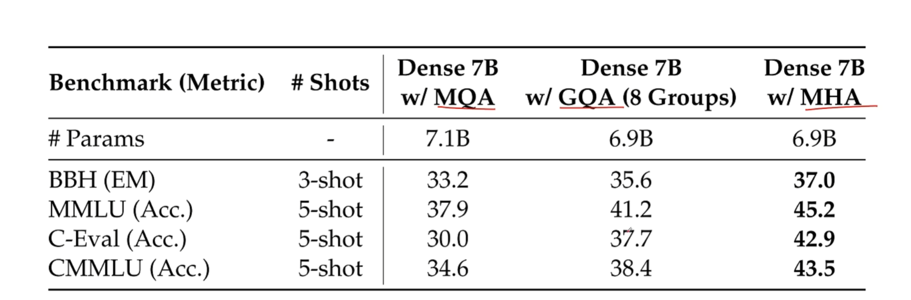
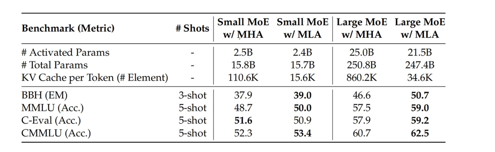
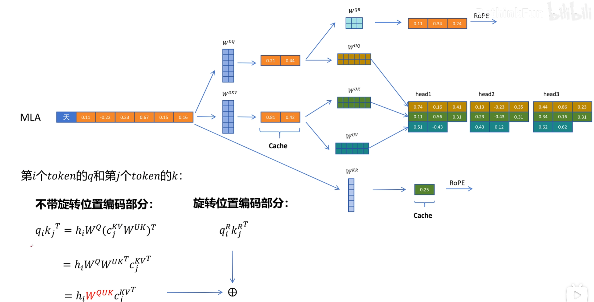

# 多头潜在注意力机制（Multi-Head Latent Attention，MLA）

deepseek-v2对注意力层进行了修改。采用的多头潜在注意力机制。
多头潜在注意力机制（Multi-Head Latent Attention，MLA）是一种创新的注意力机制，旨在解决传统Transformer模型中键值缓存（KV Cache）带来的内存瓶颈问题。

## 为什么要kv-cache？

好的！我们可以通过一个具体的例子来理解为什么需要 KV 缓存（Key-Value Cache），以及它如何优化 Transformer 模型的推理过程。

### 场景：文本生成

假设我们使用一个基于 Transformer 的语言模型（如 GPT）来生成一段文本。模型的任务是根据给定的提示（Prompt）逐词生成后续内容。

#### **1. 无 KV 缓存的情况**

假设我们需要生成一段文本，提示是：“今天天气很好，我决定去公园散步。”，模型需要逐词生成后续内容。

在没有 KV 缓存的情况下，每次生成一个新的词，模型都需要重新计算所有历史词的 **Key (K)** 和 **Value (V)** 矩阵。具体步骤如下：

- **生成第一个词**：“今天天气很好，我决定去公园散步” → **“，”**
  - 计算整个序列（“今天天气很好，我决定去公园散步”）的 **Key (K)** 和 **Value (V)** 矩阵。
  - 使用当前的 **Query (Q)** 向量与这些 **K** 和 **V** 计算注意力，生成下一个词 “，”。
- **生成第二个词**：“今天天气很好，我决定去公园散步，” → **“然后”**
  - 再次计算整个序列（“今天天气很好，我决定去公园散步，”）的 **Key (K)** 和 **Value (V)** 矩阵。
  - 使用当前的 **Query (Q)** 向量与这些 **K** 和 **V** 计算注意力，生成下一个词 “然后”。
- **生成第三个词**：“今天天气很好，我决定去公园散步，然后” → **“我”**
  - 再次计算整个序列（“今天天气很好，我决定去公园散步，然后”）的 **Key (K)** 和 **Value (V)** 矩阵。
  - 使用当前的 **Query (Q)** 向量与这些 **K** 和 **V** 计算注意力，生成下一个词 “我”。

**问题**：

- 每次生成一个新词，都需要重新计算所有历史词的 **Key (K)** 和 **Value (V)** 矩阵。
- 这种重复计算非常耗时，尤其是当序列长度变长时（例如生成长文本），计算复杂度会呈平方级增长（O(N²)）。

#### **2. 使用 KV 缓存的情况**

现在我们引入 KV 缓存，看看它如何优化这个过程。

- **预填充阶段**：
  - 在开始生成之前，先计算整个提示（“今天天气很好，我决定去公园散步”）的 **Key (K)** 和 **Value (V)** 矩阵，并将它们存储在缓存中。
- **生成第一个词**：“今天天气很好，我决定去公园散步。” → **“，”**
  - 使用当前的 **Query (Q)** 向量与缓存中的 **K** 和 **V** 计算注意力，生成下一个词 “，”。
  - 将新生成的词 “，” 的 **Key (K)** 和 **Value (V)** 追加到缓存中。
- **生成第二个词**：“今天天气很好，我决定去公园散步，” → **“然后”**
  - 使用当前的 **Query (Q)** 向量与缓存中的 **K** 和 **V** 计算注意力，生成下一个词 “然后”。
  - 将新生成的词 “然后” 的 **Key (K)** 和 **Value (V)** 追加到缓存中。
- **生成第三个词**：“今天天气很好，我决定去公园散步，然后” → **“我”**
  - 使用当前的 **Query (Q)** 向量与缓存中的 **K** 和 **V** 计算注意力，生成下一个词 “我”。
  - 将新生成的词 “我” 的 **Key (K)** 和 **Value (V)** 追加到缓存中。

1. 对于第一个注意力输出 $\text{Att}_1(Q, K, V)$：
   $$
   \text{Att}_1(Q, K, V) = \text{softmaxed} \left( Q_1 K_1^T \right) \vec{V}_1
   $$

2. 对于第二个注意力输出 $\text{Att}_2(Q, K, V)$：
   $$
   \text{Att}_2(Q, K, V) = \text{softmaxed} \left( Q_2 K_1^T \right) \vec{V}_1 + \text{softmaxed} \left( Q_2 K_2^T \right) \vec{V}_2
   $$

3. 对于第三个注意力输出 $\text{Att}_3(Q, K, V)$：
   $$
   \text{Att}_3(Q, K, V) = \text{softmaxed} \left( Q_3 K_1^T \right) \vec{V}_1 + \text{softmaxed} \left( Q_3 K_2^T \right) \vec{V}_2 + \text{softmaxed} \left( Q_3 K_3^T \right) \vec{V}_3
   $$

可以看到对于推理过程，每次推理都需要用到之前的KV，所以使用KV-缓存可以有效减小计算量。

**优化点**：

- **避免重复计算**：每次生成新词时，只需要计算当前词的 **Query (Q)**，而不需要重新计算所有历史词的 **Key (K)** 和 **Value (V)**。
- **显著提升效率**：计算复杂度从 O(N²) 降低到 O(N)，推理速度大幅提升。
- **节省资源**：减少了计算资源的浪费，尤其是在处理长序列时。

**缺点**：

以空间换时间，虽然节省了计算量，但是需要显存空间来存储KV，如果输入的序列过长，会导致显存不足的情况。我们的多头潜在注意力机制就是解决这个问题的。

## 对KV缓存进行优化

### Multi-query attention

对话过长的情况，会导致显存不足的情况，为了缓解了这个问题，我们引入了MQA。
对多头注意力机制中的KV进行优化，对多头中的K、V使用相同的K、V，这样就可以减少显存消耗。假如是八个头的注意力机制，我们就能将KV-cache减少到之前的1/8。

**优点**：减小了显存消耗。
**缺点**：显著影响了模型的性能。

### 对MQA的折中优化：GQA分组注意力机制

将多头中的query进行分组，每组query共享一个K、V。这样对性能的影响会变小，但性能下降的程度还是很高。

## 既能减小显存消耗，又能提高性能的方法：MLA

### 压缩矩阵

将K和V通过一个压缩矩阵，将KV进行压缩，从而减少显存消耗。

### 解压矩阵

要用到K和V时通过一个解压矩阵，将KV进行解压。

可以看到这个方法不仅节省了显存消耗，同时提高了模型的性能。

### 具体流程

1. **计算和存储**：
   - 对于当前 Token，计算其 Query（Q）：
     - $Q = XW^{DQ}W^{UQ}$。
     - $C^{KV} = XW^{DKV}$（压缩后的矩阵）
     - $K = C^{KV}W^{UK}$
     - $V = C^{KV}W^{UV}$
   - 对于之前 Token，计算并存储它们的 Key（K）和 Value（V）：

     - 从 $C^{KV}$ 中分离出 Key 和 Value：
       - $K = C^{KV}W^{UK}$：使用权重矩阵 $W^{UK}$ 从缓存中提取 Key。
       - $V = C^{KV}W^{UV}$：使用权重矩阵 $W^{UV}$ 从缓存中提取 Value。

2. **存入缓存**：
   - 将计算得到的 $C^{KV}$ 存入缓存，以便在生成下一个 Token 时使用。

**注意力计算的公式推导**：

1. **基本的注意力计算公式**：
   - $\text{attention} = \text{softmax}\left(\frac{QK^T}{\sqrt{d}}\right)V$：这是标准的注意力计算公式，其中 $d$ 是缩放因子，通常是 Key 的维度。

2. **利用缓存的注意力计算**：
   - 首先，计算 $Q$ 和 $K$ 的点积：
     - $QK^T = XW^Q(C^{KV}W^{UK})^T$。
   - 然后，将点积结果与 $V$ 相乘：
     - $\text{softmax}\left(\frac{XW^Q(C^{KV}W^{UK})^T}{\sqrt{d}}\right)V$。
   - 进一步简化公式，合并矩阵 $W^{QUK}$：
     - $\text{softmax}\left(\frac{XW^{QUK^T}C^{KV^T}}{\sqrt{d}}\right)V$。
3. **解耦旋转位置嵌入**：

Q向量通过$W^{QR}生成Q的旋转位置编码，拼接到Q向量中，得到新的Q向量。
K向量同理。同时$K^{KR}$也能通过压缩存储。

## 核心原理

1. **低秩键值联合压缩**：MLA通过低秩矩阵分解技术，将高维的键（Key）和值（Value）矩阵分解为低秩表示。具体来说，将一个矩阵分解为两个低秩矩阵的乘积，从而显著减少存储KV的维度，降低内存占用。在推理过程中，经过压缩的低维K和V输出会被缓存，而在进行注意力计算时，通过上投影矩阵将缓存中的潜在向量解压缩，重构出K、V矩阵。
2. **解耦旋转位置嵌入（Decoupled RoPE）**：为了整合相对位置信息，MLA采用了解耦的旋转位置嵌入方法。该方法用额外的Query和共享Key专门处理相对位置信息，避免RoPE与压缩矩阵冲突，同时保留位置敏感性。
3. **权重矩阵吸收技巧**：MLA还通过矩阵吸收技术将位置编码与注意力计算相结合，进一步提高计算效率。

### 工作流程

1. **输入映射到潜在空间**：将输入数据通过一个映射函数投影到低维潜在空间，提取输入数据的核心特征，丢弃一些不重要的细节。
2. **潜在空间中的多头注意力计算**：在低维潜在空间中执行多头注意力计算，将所有注意力头的输出拼接。
3. **映射回原始空间**：将多头注意力的结果从潜在空间映射回原始空间，得到最终的输出。

### 优势

1. **显著降低内存占用**：通过低秩压缩，MLA大幅减少了KV缓存的内存占用，使得模型在处理长序列或大批次数据时更加高效。
2. **提升推理速度和吞吐量**：由于减少了计算量和内存占用，MLA在推理阶段能够实现更快的处理速度和更高的吞吐量。
3. **保持或提升模型性能**：尽管进行了压缩，MLA在性能上并不逊色于传统的多头注意力机制（MHA），甚至在某些情况下表现更优。
4. **增强语义表达能力**：在低维潜在空间中进行注意力计算，能够更好地捕捉数据的全局依赖关系，提升模型对语义的理解能力。

### 应用场景

MLA主要应用于需要高效推理的大语言模型中，如DeepSeek-V2和DeepSeek-V3模型。这些模型通过采用MLA机制，在保持强大性能的同时，显著降低了推理成本和内存需求，适用于长文本生成、对话系统等对内存和计算效率要求较高的场景。

综上所述，MLA是一种在保持或提升模型性能的同时，显著降低内存和计算开销的创新注意力机制，为大语言模型的高效推理提供了有力支持。
