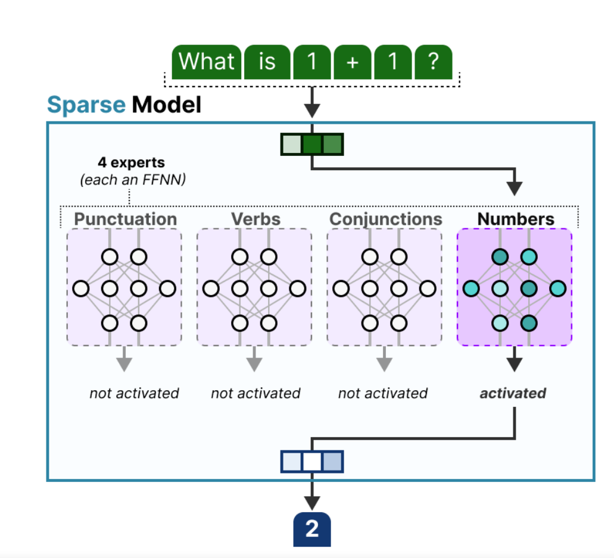

# 混合专家模型

## 1. 什么是混合专家模型

**混合专家模型（Mixture of Experts，简称 MoE）** 是一种先进的神经网络架构，旨在通过整合多个 **专门化的子模型（或称为“专家”）** 的预测来提升整体模型性能。其核心思想是将**复杂任务分解为多个子任务** ，并由不同的 **专家** 分别处理，从而实现更高的效率和更好的性能。简单说就是**分工**，混合专家模型比如**deepseek-R1**，满血版的模型总参数量为**671B**，但它在运行时的**激活参数量为370B**，大大节省了算力。因为每个token只会激活**一部分专家**，所以**激活参数量**比**总参数量**要小很多。详细请看：[揭秘DeepSeek：引领开源模型新纪元（deepseek模型发展路径和训练流程）](https://blog.csdn.net/2302_80236633/article/details/145909369?spm=1011.2124.3001.6209)

### 1.2 术语解释

- **专家（Expert）**：每个专家是一个独立的子模型，通常是一个小型的**神经网络**，专注于处理输入数据的一个**特定子集或特征**。
- **门控网络（Gate Layer）**：负责根据**输入数据**的特征，**动态选择最适合的专家**，并**分配权重**。
- **混合机制（Mixture Mechanism）**：将多个专家的输出**按权重汇总**，形成**最终的模型输出**。

### 1.3 MoE模型的优点

- **高效处理复杂任务**：通过将任务分解为**多个子任务**，每个专家可以专注于自己**擅长**的部分。
- **计算效率高**：每次输入只激活部分专家，而不是整个模型，**显著降低了计算成本**。
- **可扩展性强**：可以在有限的计算资源下**扩展模型规模**。

## 2. 实例分析-MoE 在图像分类中的应用

假设我们正在开发一个**图像分类模型**，目标是**识别不同类型的动物（如猫、狗、鸟等）**。传统的单一模型可能难以**同时处理所有动物的特征**，而混合专家模型可以通过**分工来提高效率**。

### 2.1 模型架构设计

**专家（Experts）**：

- **专家1**：擅长生成描述性文本，如风景描写。
- **专家2**：擅长生成对话性文本，如人物对话。
- **专家3**：擅长生成技术性文本，如产品说明书。
  
**门控网络（Gate Layer）**：

- 根据输入提示（prompt）的语义特征，动态选择最适合的专家。

**混合机制**：

- 将各专家的输出按权重汇总，生成最终的文本。
  
#### 2.1.1 工作流程：

**输入提示**：假设输入提示是“描述一个美丽的海滩”。
  
**门控网络决策**：

- 门控网络分析提示，判断其属于描述性文本。
- 为专家1分配较高权重（如0.7），为其他专家分配较低权重（如0.2）。

**专家处理**：

- 专家1生成描述海滩的文本，如“阳光洒在金色的沙滩上，海浪轻轻拍打着岸边……”。
- 专家2和专家3也会生成文本，但由于权重较低，它们的输出对最终结果影响较小。
  
**输出汇总**：

- 将各专家的输出按权重加权求和，生成最终的描述性文本

## 3 专家的具体结构

以**DeepSeek-R1**为例，它是一个基于**混合专家模型（MoE）架构**的超大规模语言模型。

DeepSeek-R1 的 MoE 架构中，每一层网络包含 **1个共享专家（shared expert）** 和 **256个路由专家（routed expert）**。在每次推理过程中，每个 token 会**动态激活 8个路由专家**。这种设计使得模型能够在推理时仅激活部分专家，从而显著降低计算量。

### 3.1 共享专家（Shared Experts）

**共享专家是 MoE 架构中的一种特殊专家类型**，其特点是**固定激活**。无论输入数据如何，**共享专家始终参与计算**，主要用于处理通用特征或任务

### 3.2 路由专家（Routed Experts）

**路由专家（Routed Expert）** 是一种特殊的专家网络，其激活与否由**门控网络（Gating Network）动态决定**。它们是**模型中负责处理输入数据的专家网络的一部分**，但与传统的“共享专家”不同，**路由专家的激活是稀疏的**、**基于输入的上下文特征的**。

**在 MoE 架构中，路由专家的工作流程如下**：

- **输入数据到达**：输入数据首先被传递到门控网络。
- **门控网络评分**：门控网络根据输入数据的特征，为每个路由专家计算**一个评分（或概率）**，表示该专家对当前输入的**适配度**。
- **选择激活的专家**：门控网络根据评分选择**排名最高的 Top-K 个路由专家进行激活**。例如，在 DeepSeek-R1 中，每个输入 token 会激活 **8个路由专家**。

#### 3.2.1 路由专家的示例

假设我们正在处理一个**自然语言处理任务，比如文本分类**。模型的 MoE 架构可能包含以下类型的路由专家：

- 专家1：专注于处理情感分析相关的特征。
- 专家2：专注于处理主题分类相关的特征。
- 专家3：专注于处理语法结构相关的特征。
  
当输入一段文本时，**门控网络会根据文本内容动态选择最适合的路由专家进行处理**。例如：
如果输入文本是情感强烈的评论，门控网络可能会激活 **专家1**。
如果输入文本是关于某个主题的新闻报道，门控网络可能会激活 **专家2**。

### 3.3 其他专家

**1. 密集专家（Dense Experts）**：

密集专家是 MoE 架构中的另一种专家类型，与**稀疏专家（路由专家）**相对。密集专家的特点是全激活，即在每次计算中，**所有密集专家都会被激活**。这种设计适用于需要全面处理输入数据的场景，但**计算成本相对较高**。

**2. 细粒度专家（Fine-Grained Experts）**：

细粒度专家是 MoE 架构中的一种优化设计，通过将单个专家进一步细分为更小的单元，以实现更高的专业化。

**3.条件专家（Conditional Experts）**：

条件专家是一种动态激活的专家类型，其激活与否取决于输入数据的特定条件。例如，某些专家可能只在输入数据满足特定条件时被激活，从而实现更灵活的任务处理。

### 3.4 专家的一般结构

**专家通常是基于前馈神经网络（FFN）**的结构，类似于 Transformer 中的**前馈层**。这种结构简单且高效，**能够对输入数据进行非线性变换**。然而，专家的结构并不局限于 FFN，也可以是更复杂的网络，**甚至可以是 MoE 层本身，从而形成层级式的 MoE 结构**。

专家在 MoE 架构中替代了传统 Transformer 中的前馈网络（FFN）层。通过门控网络动态选择合适的专家，模型能够根据输入数据的特征灵活地分配计算资源，从而提高效率和性能

## 4.门控网络

在混合专家模型（MoE）架构中，**门控网络（Gating Network）** 是实现稀疏激活和动态选择专家的核心组件。

**功能**：

门控网络的主要作用是为**每个输入**（例如语言模型中的 token）**动态选择** 最合适的专家。它通过计算每个**专家的激活概率**，决定哪些专家将被激活来处理当前输入。

**门控网络的结构**：

门控网络通常是一个**简单的前馈神经网络（FFN）**，包含一个或多个线性层，最后通过 **Softmax 函数输出一个概率分布**。这个分布表示每个专家对当前**输入的适配度**。

**Top-K 选择机制**：

在实际应用中，门控网络会根据输出的概率分布选择 **Top-K** 个专家进行激活。例如，对于每个输入 **token**，门控网络会计算所有专家的得分，并选择得分**最高的 K 个专家**。这种稀疏激活机制显著降低了计算成本。

## 4.负载均衡机制

为了避免某些专家过载，**门控网络还会引入负载均衡机制**。例如，**通过限制每个专家处理**的 token 数量（Expert Capacity），或者在**训练时引入辅助损失函数（如负载均衡损失）**，鼓励更**均匀地分配输入**。

```python
import torch
import torch.nn as nn
import torch.nn.functional as F

class Expert(nn.Module):
    """
    一个简单的专家网络，使用两层全连接网络。
    """
    def __init__(self, input_dim, hidden_dim, output_dim):
        super(Expert, self).__init__()
        self.fc1 = nn.Linear(input_dim, hidden_dim)
        self.fc2 = nn.Linear(hidden_dim, output_dim)
    
    def forward(self, x):
        x = F.relu(self.fc1(x))
        x = self.fc2(x)
        return x

class GatingNetwork(nn.Module):
    """
    门控网络，用于动态选择专家。
    """
    def __init__(self, input_dim, num_experts):
        super(GatingNetwork, self).__init__()
        self.fc = nn.Linear(input_dim, num_experts)
    
    def forward(self, x):
        # 输出每个专家的权重，使用 Softmax 归一化
        weights = F.softmax(self.fc(x), dim=-1)
        return weights

class MixtureOfExperts(nn.Module):
    """
    混合专家模型，包含多个专家和一个门控网络。
    """
    def __init__(self, input_dim, hidden_dim, output_dim, num_experts, k=2):
        super(MixtureOfExperts, self).__init__()
        self.experts = nn.ModuleList([Expert(input_dim, hidden_dim, output_dim) for _ in range(num_experts)])
        self.gating_network = GatingNetwork(input_dim, num_experts)
        self.k = k  # 每次激活的专家数量
    
    def forward(self, x):
        # 计算门控网络的权重
        weights = self.gating_network(x)  # [batch_size, num_experts]
        
        # 获取 Top-K 专家的权重和索引
        top_k_weights, top_k_indices = torch.topk(weights, k=self.k, dim=-1)  # [batch_size, k]
        
        # 初始化输出
        batch_size, seq_len, _ = x.size()
        output = torch.zeros(batch_size, seq_len, output_dim, device=x.device)
        
        # 遍历每个专家，计算其输出并加权求和
        for i in range(self.k):
            expert_idx = top_k_indices[:, :, i]  # 当前激活的专家索引
            expert_output = self.experts[expert_idx](x)  # [batch_size, seq_len, output_dim]
            output += expert_output * top_k_weights[:, :, i].unsqueeze(-1)  # 加权求和
        
        return output

# 示例：使用 MoE 模型
if __name__ == "__main__":
    # 参数设置
    input_dim = 10
    hidden_dim = 20
    output_dim = 5
    num_experts = 4
    k = 2  # 每次激活的专家数量

    # 创建模型
    model = MixtureOfExperts(input_dim, hidden_dim, output_dim, num_experts, k)

    # 创建输入数据
    batch_size = 3
    seq_len = 5
    input_data = torch.randn(batch_size, seq_len, input_dim)

    # 前向传播
    output = model(input_data)
    print("Output shape:", output.shape)  # 应该是 [batch_size, seq_len, output_dim]

```

解释：

- Expert 类：每个专家是一个简单的两层全连接网络，用于处理输入数据。
- GatingNetwork 类：门控网络是一个单层全连接网络，输出每个专家的权重，并通过 Softmax 归一化。
- MixtureOfExperts 类：这是主模型，包含多个专家和一个门控网络。它通过门控网络动态选择 Top-K 专家，并将它们的输出加权求和。
- 前向传播：输入数据通过门控网络计算权重，然后选择 Top-K 专家进行处理，最后将专家的输出按权重加权求和

**作者码字不易，觉得有用的话不妨点个赞吧，关注我，持续为您更新AI的优质内容**。