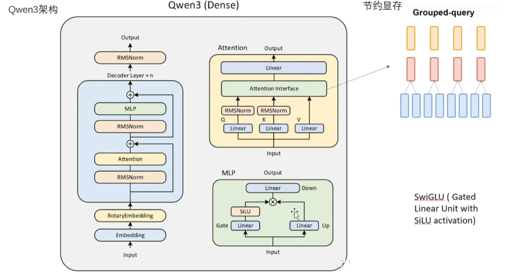

# 通义千问Qwen3模型：思考更深邃，行动更迅速

## 模型参数

Qwen3系列模型的参数量从0.6B到235B不等，具体如下：

|模型名称|总参数量|激活参数量|架构类型|
|---|---|---|---|
|Qwen3-235B-A22B|2350亿|220亿|MoE|
|Qwen3-30B-A3B|300亿|30亿|MoE|
|Qwen3-32B|320亿|320亿|Dense|
|Qwen3-14B|140亿|140亿|Dense|
|Qwen3-8B|80亿|80亿|Dense|
|Qwen3-4B|40亿|40亿|Dense|
|Qwen3-1.7B|17亿|17亿|Dense|
|Qwen3-0.6B|6亿|6亿|Dense|

qwen3这次开源出了两个MOE模型，还有六个小的稠密模型，稠密模型基本是由大模型蒸馏出来的。

## qwen3的模型特性

### 采用GQA的架构

在原本的transformer架构中，QKV三个矩阵是一一对应的，qwen3采用了GQA（分组注意力机制）对应一组一组KV矩阵，节约显存，训练时可以加快收敛。同时在Q、K矩阵采用了归一化的策略

### 采用滑动窗口的上下文策略

采用长度为4096的滑动窗口来看上下文，每个token可以看到前面4096个token的上下文，可以加快推理速度，增强长文本能力

### MOE架构

qwen3开始采用MOE架构，以加速推理速度和提高模型性能，可以看出，MOE架构应该就是以后模型的主流架构。
qwen3有128个专家，选取前8个专家进行推理，其他专家不参与推理，可以减少显存占用，提高推理速度。

### 推理模式切换

Qwen3支持“思考模式”和“非思考模式”两种工作方式。思考模式适合复杂问题，模型会逐步推理后再给出答案；非思考模式提供快速、近乎即时的响应，适合简单问题。原本我们思考和非思考都要进行模型的切换，但是qwen3通过传参来把两种模式合二为一，只需要传参即可切换。通过在分词器上传参来决定是否思考，分词器会根据传参来加入相应的\<think\>标签告诉模型是否思考

qwen3可以控制思考的长度，有**思考预算**参数，可以控制模型思考的长度

### 训练语料和训练过程

qwen3支持119种语种或者方言，先训练主流的语言，如英语、中文，再通过少量的平行语料对小语种进行启发和激活

#### 预训练(pre train)

数据：
网络爬取的高质量的文本
使用qwen2.5-VL从PTF种提取出内容
有Qwen2.5math和Qwen2.5-coder合成专业的领域数据

- 第一阶段： 基础语言建模，30万亿token，4K上下文建模。建立基本语言技能和通用知识
- 第二阶段： 知识密集优化，5万亿token，增强推理能力、专业领域的能力
- 第三阶段：长上下文拓展，高质量的长上下文数据，将上下文长度拓展到32k，增强处理长序列处理能力

### 后训练(post train)

- 第一阶段：长思维链冷启动，使用多样的长思维链数据对模型进行微调，涵盖数学、代码、逻辑推理和STEM问题等领域和任务，旨在为模型配备基本的逻辑推理能力。
- 第二阶段：通过基于规则奖励的强化学习，利用规则奖励增强探索能力
- 第三阶段：思维模式融合，通过长思维链和指令微调数据整合思考和非思考能力。
- 第四阶段：通用强化学习能力，包括指令遵循、格式遵循、agent能力等20个通用领域任务上应用了强化学习，增强模型的通用能力、纠正不良行为。

253B的模型和32B的模型（MOE）都是这样训练出来的。
6个稠密模型都是在这两个模型的基础上进行蒸馏的。与deepseek不同的一点是qwen3使用没有训练过的模型进行蒸馏的。

## 和qwen2.5相比

### 模型架构更加深

qwen2.5-7B有28层，维度为3584，qwen3-8B有36层，维度为4096，模型架构更加深，模型性能更加强大。

### 训练与性能

- 训练流程：Qwen3采用了四阶段训练流程，包括长思维链冷启动、长思维链强化学习、思维模式融合和通用强化学习。
- 性能表现：Qwen3在多个基准测试中表现出色，例如在AIME25中获得81.5分，刷新开源纪录；在LiveCodeBench中超过70分，表现甚至超过Grok3。

