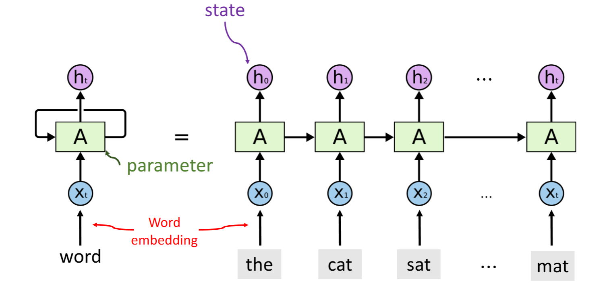
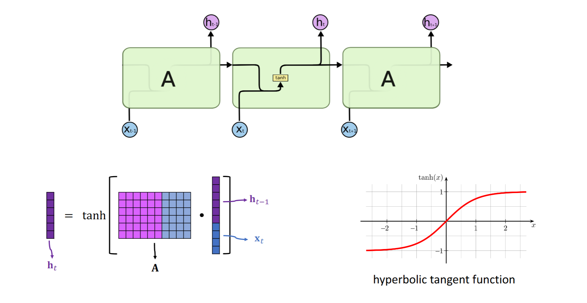

# 1.simple RNN

循环神经网络（Recurrent Neural Network, RNN）是一种特殊的神经网络，它被设计用来处理序列数据。RNN的基本思想是通过在网络中引入环状连接来实现对序列信息的记忆和利用。与传统的前馈神经网络不同，RNN能够接收一个输入序列，并在处理序列中的每个元素时，同时考虑之前已经处理过的元素的信息。

## 2.结构特点

RNN的这种特性使得它非常适合处理那些元素之间存在顺序依赖关系的数据，例如时间序列数据、自然语言文本、语音信号等。在这些应用场景中，当前时刻的状态往往受到过去时刻状态的影响，因此使用RNN可以更好地捕捉到这种时间上的动态变化。

RNN的核心在于它的隐藏层单元，也就是所谓的“记忆体”，它可以在不同的时间步之间传递信息。具体来说，在每一个时间步$t$，RNN都会接受一个新的输入$x_t$，并结合上一时间步的隐藏状态$h_(t-1)$来计算当前时间步的隐藏状态$h_t$。这个过程可以通过以下公式描述：

$$h_t = \sigma(W_{hx}x_t + W_{hh}h_{t-1} + b_h)$$

其中，$W_{hx}$ 和 $W_{hh}$ 分别表示从输入到隐藏层以及从隐藏层到自身的权重矩阵，$b_h$ 是偏置项，而 $\sigma$ 表示激活函数，通常选择的是tanh或ReLU等非线性函数。

## 3.具体的数据输入流程



参数矩阵A只有一个，我们在输入数据时将状态$h_t$与下一个token$X_t$作为输入，并更新状态$h_t$，不断循环直到输入序列结束。

## 4.特点

状态$h_t$是RNN的核心，它通过不断迭代更新，来记录输入序列中每个位置的信息。在RNN中，状态$h_t$的更新是由输入$x_t$和上一时间步的隐藏状态$h_{t-1}$共同决定的，因此，RNN的记忆功能非常强大，能够捕捉到输入序列中任意位置的信息。

## 5.为什么需要tanh函数

没有激活函数，输出的数据随输入的变化而变化，这导致RNN在处理长序列时容易出现梯度消失或爆炸的问题。

## 5.总结

然而，尽管RNN具有记忆功能，但在实际应用中，标准的RNN结构往往难以学习到长距离的历史信息，这是由于梯度消失或爆炸问题导致的。为了解决这个问题，研究者们提出了多种改进版本的RNN，如长短期记忆网络（LSTM）和门控循环单元（GRU），它们通过精心设计的门控机制有效地缓解了长期依赖的问题。

此外，RNN还能够根据具体的任务需求调整其结构。例如，在一对多的任务中，如图像字幕生成，RNN可以从单个图像输入开始，然后逐步生成一系列描述性的词语；而在多对一的任务中，比如情感分析，RNN则可能需要处理一段文字输入，并最终输出一个代表正面或负面情绪的分类结果。

总的来说，RNN及其变种已经成为现代深度学习领域内处理序列数据的重要工具，广泛应用于包括但不限于自然语言处理、语音识别、机器翻译等领域。随着技术的发展，RNN也在不断地演进，以适应更加复杂的应用场景和技术挑战。

```python
import torch
import torch.nn as nn

# 定义RNN模型
import torch
import torch.nn as nn

# 定义RNN模型
class SimpleRNN(nn.Module):
    def __init__(self, input_size, hidden_size, output_size):
        super(SimpleRNN, self).__init__()
        self.hidden_size = hidden_size
        # 使用nn.RNN构建循环层
        self.rnn = nn.RNN(input_size, hidden_size, batch_first=True)
        # 全连接层将隐藏层输出映射到输出空间
        self.fc = nn.Linear(hidden_size, output_size)

    def forward(self, x):
        # 初始化隐藏状态为全0
        h0 = torch.zeros(1, x.size(0), self.hidden_size).to(x.device) 
        # 前向传播输入x，同时传入隐藏状态
        out, _ = self.rnn(x, h0)  # out: tensor of shape (batch_size, seq_length, hidden_size)
        # 取最后一个时间步的输出，并通过全连接层得到最终输出
        out = self.fc(out[:, -1, :])
        return out

# 参数设置
input_size = 10  # 输入特征维度
hidden_size = 20  # 隐藏层大小
output_size = 5  # 输出维度

# 创建模型实例
model = SimpleRNN(input_size=input_size, hidden_size=hidden_size, output_size=output_size)

# 打印模型结构
print(model)

# 准备输入数据
batch_size = 3
seq_length = 4
input_data = torch.randn(batch_size, seq_length, input_size)

# 前向传播
output = model(input_data)
print(output)
```