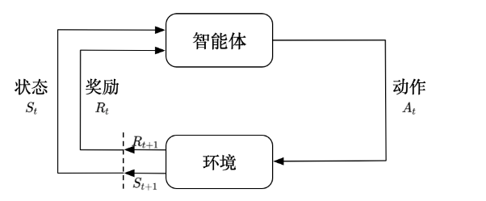
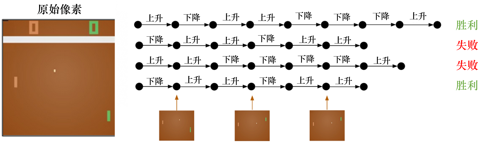
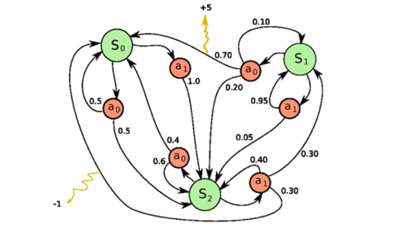

# 强化学习基础一

## 1.强化学习概述

### 1.1 什么是强化学习

**强化学习（reinforcement learning，RL）** 讨论的问题是智能体（agent）怎么在**复杂、不确定的环境（environment）** 中最大化它能获得的奖励。如图 1所示，强化学习由两部分组成：**智能体和环境**。在强化学习过程中，**智能体与环境一直在交互**。智能体在环境中获取某个状态后，它会利用该状态输出一个**动作 （action）**，这个动作也称为**决策（decision）**。然后这个动作会在**环境**中被执行，环境会根据智能体采取的动作，输出下一个**状态以及当前这个动作带来的奖励**。智能体的目的就是尽可能多地从环境中**获取奖励**。

### 1.2强化学习和监督学习

**监督学习**：

训练数据由**输入（特征）和输出（标签）**组成，通常表示为 (X, y)。监督学习**需要被标注**的数据，假设我们由一个**图片分类**的任务，来把图片二分类，即0和1。在训练过程中，我们需要将图片输入到模型中，模型会根据图片的像素值，进行分类，然后输出一个**预测值**。让后将预测值和真实值进行比较，得到一个**误差**，然后根据**误差调整模型参数，使得误差越来越小**。即是**损失函数和梯度下降**、**反向传播**。

所以在监督学习过程中，有两个**假设**：

输入的**数据（标注的数据）**都应是没有**关联**的。因为如果输入的数据有关联，学习器（learner）是不好学习的。
我们需要告诉学习器**正确的标签**是什么，这样它可以通过**正确的标签**来**修正自己的预测**。

**强化学习**：

而强化学习中不能满足这两个**假设**，我们的输入都是有**非常强的连续性和关联性**。

以雅达利（Atari） 游戏 Breakout 为例，如图所示，这是一个打砖块的游戏，控制木板左右移动从而把球反弹到上面来消除砖块。在玩游戏的过程中，我们可以发现**智能体得到的观测（observation）不是独立同分布的**，上一帧与下一帧间其实有非常强的**连续性**。我们得到的**数据是相关的时间序列数据，不满足独立同分布**。另外，我们并**没有立刻获得反馈**，游戏没有告诉我们哪个动作是**正确动作**。比如现在把木板往右移，这只会使得球往上或者往左一点儿，我们并不会得到**即时的反馈**。因此，强化学习之所以困难，**是因为智能体不能得到即时的反馈，然而我们依然希望智能体在这个环境中学习**。

### 1.3 强化学习和监督学习的区别。

**（1）** 强化学习输入的样本是**序列数据，而不像监督学习里面样本都是独立的。**

**（2）** 学习器并没有告诉我们每一步**正确**的动作应该是什么，学习器需要**自己去发现哪些动作可以带来 最多的奖励**，只能通过不停地尝试来发现最有利的动作。

**（3）**智能体获得自己能力的过程，其实是**不断地试错探索**，**（trial-and-error exploration）的过程**。探索 （exploration）和利用（exploitation）是强化学习里面非常核心的问题。其中，**探索指尝试一些新的动作， 这些新的动作有可能会使我们得到更多的奖励**，也有可能使我们“一无所有”；利用**指采取已知的可以获得最多奖励的动作，重复执行这个动作，因为我们知道这样做可以获得一定的奖励**。因此，我们需要在探索和利用之间进行权衡，这也是在监督学习里面没有的情况。

**（4）** 在强化学习过程中，没有非常强的**监督者（supervisor）**，只有**奖励信号（reward signal）**，并且**奖励信号是延迟**的，即环境会在很久以后告诉我们之前我们采取的动作到底是不是**有效的**。因为我们没有得 到**即时反馈**，所以智能体使用**强化学习来学习就非常困难**。当我们采取一个动作后，如果我们使用监督学习，我们就可以立刻获得一个指导，比如，我们现在采取了一个错误的动作，正确的动作应该是什么。而在强化学习里面，环境可能会告诉我们这个动作是错误的，但是它并没有告诉我们正确的动作是什么。而且更困难的是，它可能是在一两分钟过后告诉我们这个**动作是错误**的。所以这也是**强化学习和监督学习不同的地方**。

**通过与监督学习的比较，我们可以总结出强化学习的一些特征**。

（1）**强化学习会试错探索**，它通过探索环境来获取对环境的理解。

（2）强化学习智能体会从环境里面获得**延迟的奖励**。

（3）在强化学习的训练过程中，**时间非常重要**。因为我们得到的是有时间关联的数据（sequential data）， 而不是**独立同分布的数据**。在机器学习中，如果**观测数据有非常强的关联**，会使得训练非常不稳定。这也是为什么在监督学习中，我们希望数据尽量满足**独立同分布**，这样就可以消除数据之间的相关性。

（4）智能体的动作会影响**它随后得到的数据**，这一点是非常重要的。在训练智能体的过程中，很多时 候我们也是通过正在学习的智能体与环境交互来得到数据的。所以如果在训练过程中，智能体不能保持稳定，就会使我们采集到的数据非常糟糕。我们通过数据来训练智能体，如果数据有问题，整个训练过程就会**失败**。所以在强化学习里面一个非常重要的问题就是，**怎么让智能体的动作一直稳定地提升。**

## 2 序列决策

### 2.1智能体与环境

接下来我们**介绍序列决策（sequential decision making）过程**。强化学习研究的问题是**智能体与环境交互的问题**，智能体一直在与环境进行交互。智能体把它的动作**输出**给环境，环境取得这个动作后会进行下一步，把下一步的观测与这个动作带来的**奖励**返还给智能体。这样的交互会产生很多观测，智能体的目的是从这些观测之中学到**能最大化奖励的策略**。

### 2.2 奖励

奖励是由环境给的一种**标量的反馈信号（scalar feedback signal）**，这种信号可显示智能体在某一步采取某个**策略的表现如何**。强化学习的目的就是最大化智能体可以**获得的奖励**，智能体在环境里面存在的目 的就是最大化它的期望的**累积奖励（expected cumulative reward）**。不同的环境中，**奖励也是不同的。这里给大家举一些奖励的例子**。

**（1）比如一个象棋选手，他的目的是赢棋，在最后棋局结束的时候，他就会得到一个正奖励（赢）或者负奖励（输）。**

**（2）** 在股票管理里面，**奖励由股票获取的奖励与损失决定。**

**（3）** 在玩雅达利游戏的时候，奖励就是**增加或减少的游戏的分数**，**奖励本身的稀疏程度决定了游戏的难度**。

### 2.3 序列决策

在一个**强化学习环境**里面，智能体的目的就是选取一系列的动作来最大化奖励，所以这些选取的动作 **必须有长期的影响**。但在这个过程里面，**智能体的奖励其实是被延迟了的**，就是我们现在选取的某一步动作，可能要等到很久后才知道这一步到底产生了什么样的影响。如图所示，在玩雅达利的 Pong 游戏时，我们可能只有到最后游戏结束时，才知道球到底有没有被击打过去。过程中我们采取的**上升（up）或 下降（down）**动作，并不会直接产生奖励。强化学习里面一个重要的课题就是**近期奖励和远期奖励的权衡 （trade-off）**，研究怎么让智能体取得更多的远期奖励。
$$H_t = o_1, a_1, r_1, \ldots, o_t, a_t, r_t$$

在与环境的交互过程中，智能体会获得**很多观测**。针对每一个观测，智能体会采取一个动作，也会得到一个奖励。所以**历史是观测、动作、奖励的序列**：
$$S_t = f(H_t)$$

### 2.4 动作空间

**不同的环境允许不同种类的动作**。在给定的环境中，**有效动作的集合经常被称为动作空间（action space）**。像雅达利游戏和围棋（Go）这样的环境有**离散动作空间（discrete action space）**，在这个动作 空间里，智能体的动作数量是有限的。在其他环境，比如在物理世界中控制一个智能体，在这个环境中就有连续动作空间（continuous action space）。在连续动作空间中，动作是实值的向量。

例如，**走迷宫机器人如果只有往东、往南、往西、往北这 4 种移动方式，则其动作空间为离散动作空 间；如果机器人可以向 360 度中的任意角度进行移动，则其动作空间为连续动作空间。**

### 2.5 强化学习智能体的组成成分和类型

对于一个强化学习智能体，它可能有一个或多个如下的组成成分。

- **策略（policy）**。智能体会用策略来选取下一步的动作。

- **价值函数（value function）**。我们用价值函数来对当前状态进行评估。价值函数用于评估智能体进 入某个状态后，可以对后面的奖励带来多大的影响。价值函数值越大，说明智能体进入这个状态越有利。

- **模型（model）**。模型表示智能体对环境的状态进行理解，它决定了环境中世界的运行方式。 下面我们深入了解这 3 个组成部分的细节

#### 2.5.1 策略

策略是智能体的动作模型，它决定了智能体的动作。它其实是一个函数，用于把输入的状态变成动作。策略可分为两种：**随机性策略和确定性策略。**

随机性策略（stochastic policy）就是 \( \pi \) 函数，即 \( \pi(a|s) = p(a_t = a | s_t = s) \)。输入一个状态 \( s \)，输出一个概率。这个概率是智能体所有动作的概率，然后对这个概率分布进行采样，可得到智能体将采取的动作。比如可能是有 0.7 的概率往左，0.3 的概率往右，那么通过采样就可以得到智能体将采取的动作。

**确定性策略（deterministic policy）就是智能体直接采取最有可能的动作**，即 \( a^* = \arg\max_a \pi(a \mid s) \)。

如图所示，从雅达利游戏来看，策略函数的输入就是游戏的一帧，它的输出决定智能体向左移动或者向右移动。

#### 2.5.2 价值函数

**价值函数的值是对未来奖励的预测，我们用它来评估状态的好坏**。**价值函数里面有一个折扣因子（discount factor），我们希望在尽可能短的时间里面得到尽可能多的奖励**。比如现在给我们两个选择：10天后给我们100块钱或者现在给我们100块钱。我们肯定更希望现在就给我们100块钱，因为我们可以把这 100 块钱存在银行里面，这样就会有一些利息。因此，我们可以把**折扣因子**放到价值函数的定义里面，价值函数的定义为

$$ V_\pi(s) \doteq \mathbb{E}_\pi \left[ G_t \mid s_t = s \right] = \mathbb{E}_\pi \left[ \sum_{k=0}^{\infty} \gamma^k r_{t+k+1} \mid s_t = s \right], \text{对于所有的} s \in S $$

这个公式描述了在强化学习中的价值函数 $ V_\pi(s)  $，它是针对策略 $ \pi $ 的状态价值函数。价值函数用于评估在给定策略下，从某个状态 $ s $ 开始，智能体能够获得的期望回报（即累积奖励）。

这里的各个符号的含义如下：

- $ V_\pi(s) $：在策略 $ \pi $ 下，从状态 \( s \) 开始的期望回报。
- $ \mathbb{E}_\pi $：表示在策略 $ \pi $ 下的期望值。
- $ G_t $：从时间步 $ t $ 开始的累积折扣回报，也称为回报（return）。
- $ s_t = s $：表示在时间步 $ t $ 智能体处于状态 $ s $。
- $ \sum_{k=0}^{\infty} $：表示从 $ k = 0 $ 到无穷大的求和。
- $ \gamma^k $：折扣因子的 $ k $ 次幂，其中 $ 0 \leq \gamma < 1 $。折扣因子用于降低未来奖励的重要性，因为通常认为立即获得的奖励比未来获得的奖励更有价值。
- $ r_{t+k+1} $：在时间步 \( t+k+1 \) 获得的即时奖励。

这个公式的核心思想是，从状态 $ s $0 开始，智能体将采取一系列动作，并在每个时间步获得奖励。这些奖励会被累积起来，形成总的回报 $ G_t $。由于未来是不确定的，所以使用期望值来表示可能获得的平均回报。折扣因子 $ \gamma $ 确保了近期的奖励比远期的奖励对总回报的影响更大。
期望 $ \mathbb{E}_\pi $的下标是 $ \pi $ 函数，$ \pi $ 函数的值可反映在我们使用策略 $ \pi $的时候，到底可以得到多少奖励。

我们还有一种**价值函数：Q 函数。Q 函数里面包含两个变量：状态和动作。其定义为**

$$ Q_\pi(s, a) \doteq \mathbb{E}_\pi \left[ G_t \mid s_t = s, a_t = a \right] = \mathbb{E}_\pi \left[ \sum_{k=0}^{\infty} \gamma^k r_{t+k+1} \mid s_t = s, a_t = a \right] $$

所以我们未来可以获得奖励的期望取决于当前的状态和当前的动作。**Q 函数是强化学习算法里面要学习的一个函数。因为当我们得到 Q 函数后，进入某个状态要采取的最优动作可以通过 Q 函数得到。**

#### 2.5.3 模型

**第3个组成部分是模型，模型决定了下一步的状态。下一步的状态取决于当前的状态以及当前采取的动作**。它由状态转移概率和奖励函数两个部分组成。状态转移概率即

$$ p_{ss'}^a = p(s_{t+1} = s' \mid s_t = s, a_t = a) $$

**奖励函数是指我们在当前状态采取了某个动作**，可以得到多大的奖励，即

$$  R(s, a) = \mathbb{E} \left[ r_{t+1} \mid s_t = s, a_t = a \right] $$

当我们有了**策略、价值函数和模型3个组成部分**后，就形成了一个**马尔可夫决策过程（Markov decision process）**。如图所示，这个决策过程可视化了状态之间的转移以及采取的动作。

