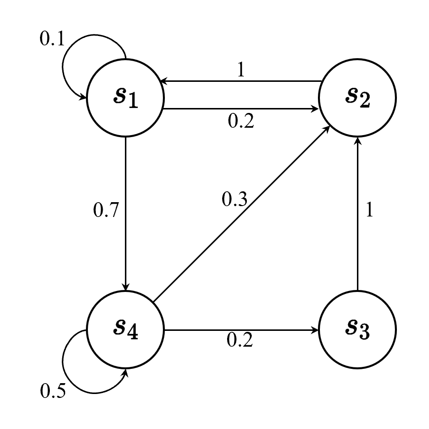

# 强化学习二-马尔可夫决策过程

## 1. 马尔可夫决策过程

### 1.1马尔可夫性质

**马尔可夫性质（Markov Property）**是随机过程中的一个基本概念，它描述了过程的**无后效性**。具体来说，如果一个随机过程具有**马尔可夫性质** ，那么在给定当前状态的条件下，**未来状态的分布与过去状态无关**。**换句话说，过程的未来行为仅依赖于当前状态，而与之前的历史状态无关**。

在随机过程中，**马尔可夫性质**（Markov property）是指一个随机过程在给定现在状态及所有过去状态情况下，其未来状态的条件概率分布仅依赖于当前状态。以离散随机过程为例，假设随机变量 \(X_0, X_1, \cdots, X_T\) 构成一个随机过程。这些随机变量的所有可能取值的集合被称为状态空间（state space）。如果 \(X_{t+1}\) 对于过去状态的条件概率分布仅是 \(X_t\) 的一个函数，则

$$ p(X_{t+1} = x_{t+1} \mid X_{0:t} = x_{0:t}) = p(X_{t+1} = x_{t+1} \mid X_t = x_t) $$

其中，$ X_{0:t} $ 表示变量集合 $ X_0, X_1, \cdots, X_t $，$ x_{0:t} $ 为在状态空间中的状态序列 $ x_0, x_1, \cdots, x_t $。马尔可夫性质也可以描述为给定当前状态时，将来的状态与过去状态是条件独立的。如果某一个过程满足**马尔可夫性质**，那么未来的转移与过去的是独立的，**它只取决于现在**。马尔可夫性质是所有马尔可夫过程的基础。

### 1.2 马尔可夫链

马尔可夫过程是一组具有马尔可夫性质的随机变量序列 $ s_1, \cdots, s_t $ ，其中下一个时刻的状态 $ s_{t+1} $ 只取决于当前状态 $ s_t $。我们设状态的历史为 $ h_t = \{s_1, s_2, s_3, \ldots, s_t\} $ $ h_t $ 包含了之前的所有状态），则马尔可夫过程满足条件：

$$ p(s_{t+1} \mid s_t) = p(s_{t+1} \mid h_t) $$

从当前 $ s_t $ 转移到 $ s_{t+1} $，它是直接就等于它之前所有的状态转移到 $ s_{t+1} $。

离散时间的马尔可夫过程也称为**马尔可夫链**（Markov chain）。马尔可夫链是最简单的马尔可夫过程，其状态是有限的。例如，图 里面有 4 个状态，这 4 个状态在 $ s_1, s_2, s_3, s_4 $ 之间互相转移。比如从  $ s_1 $ 开始，$ s_1 $ 有 0.1 的概率继续存留在 $ s_1 $ 状态，有 0.2 的概率转移到 $ s_2 $，有 0.7 的概率转移到 $ s_4 $。如果 $ s_4 $ 是我们的当前状态，它有 0.3 的概率转移到 $ s_2 $，有 0.2 的概率转移到 $ s_3 $，有 0.5 的概率留在当前状态。

我们可以用**状态转移矩阵**（state transition matrix）\( P \) 来描述状态转移 \( p(s_{t+1} = s' \mid s_t = s) \)：

$$ P = \left(
\begin{array}{ccc}
p(s_1 \mid s_1) & p(s_2 \mid s_1) & \cdots & p(s_N \mid s_1) \\
p(s_1 \mid s_2) & p(s_2 \mid s_2) & \cdots & p(s_N \mid s_2) \\
\vdots & \vdots & \ddots & \vdots \\
p(s_1 \mid s_N) & p(s_2 \mid s_N) & \cdots & p(s_N \mid s_N) \\
\end{array}
\right) $$

状态转移矩阵类似于条件概率（conditional probability），它表示当我们知道当前我们在状态 $ s_t $ 时，到达下面所有状态的概率。所以它的每一行描述的是从**一个节点到达所有其他节点的概率**。
