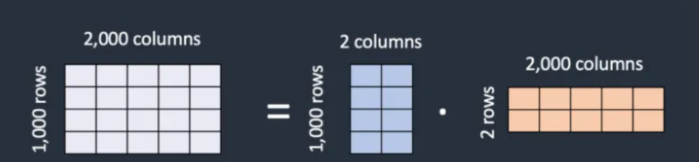
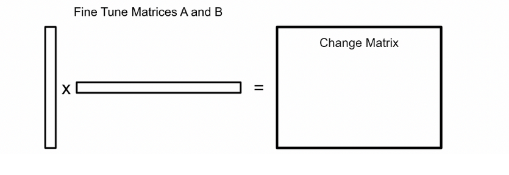

# 什么是LoRA微调

**LoRA（Low-Rank Adaptation）**是一种**高效的微调技术**，主要用于对**大规模语言模型进行优化**，使其更好地适应特定任务，直译为**低秩矩阵微调**。它最初应用于**NLP领域**，LoRA通过仅训练低秩矩阵，然后将这些参数注入到原始模型中，**从而实现对模型的微调**。这种方法不仅减少了计算需求，而且使得训练资源比直接训练原始模型要小得多，因此非常适合在**资源有限**的环境中使用。

总的来说，LoRA是一种**高效的微调技术**，与**全量微调**相比，它消耗的**计算资源**更少，并且**训练速度**更快，但效果很好，因此适合在**资源有限**的环境中使用。

## 动机

在传统的**全参数微调**中，预训练模型的**所有参数**都会被更新，这会导致以下问题：
**计算成本高**：更新大量参数需要大量的计算资源和时间。
**内存占用大**：需要存储大量的梯度和优化器状态。
**容易过拟合**：在小数据集上容易导致模型过拟合。
LoRA通过只更新**少量参数**来解决这些问题。

## 1.什么是矩阵的秩

**矩阵的秩（Rank of a Matrix）**是*线性代数*中的一个基本概念，它描述了矩阵中**线性独立**的行向量或列向量的最大数目。
矩阵的秩是为了量化矩阵中的**线性独立性**。我们可以将一个**矩阵分解为一些线性独立的向量**；这种矩阵的形式被称为“行阶梯形式”。

> 因此，矩阵可以包含一定程度的 **“重复信息”** ，即**线性相关性**。如果你有一个大矩阵，具有显著的线性相关性（因此秩较低），可以将该矩阵表示为两个相对较小的矩阵的乘积。这种分解的思想使得LoRA占用了如此小的内存空间。

### 1.1 低秩矩阵

> 如果一个**矩阵的秩较低**，说明其行向量或列向量之间存在较强的**线性相关性**。这意味着矩阵中包含的**独立信息较少**，可以通过**更少的参数**来表示。例如，LoRA（Low-Rank Adaptation）技术正是利用**低秩矩阵**来减少模型参数，从而**降低计算成本和内存占用**

简单来说，一个矩阵秩代表者矩阵的**信息量**，如果一个大矩阵的秩较低，说明其**信息量**较少，可以通过**更少的参数**来表示，，即用小矩阵来表示**大矩阵**，从而**降低计算成本和内存占用**。

### 1.2低秩分解

通过将**高秩矩阵**分解为**低秩矩阵的乘积**，可以显著**减少模型的参数量**。例如，矩阵分解技术（如SVD）可以用于压缩神经网络的权重矩阵，从而降低模型的**存储和计算成本**




## 2.LoRA微调的步骤

### 2.1 低秩矩阵分解

对于模型中的某些关键层（如注意力层的`q_proj`、`k_proj`、`v_proj`、`o_proj`，以及MLP层的`gate_proj`、`up_proj`、`down_proj`），LoRA将原始权重矩阵`W`分解为两个低秩矩阵`A`和`B`的乘积：

- 原始权重矩阵：`W`
- 低秩分解：`W ≈ A × B`
- 其中，`A`和`B`的秩远小于`W`的秩，从而减少参数量。

### 2.2 对原矩阵进行更新

$$
 W' = W + A \times B
$$

- \( W \) 是原始模型的权重矩阵。
- \( A \) 和 \( B \) 是低秩矩阵，其秩 \( r \) 远小于 \( W \) 的秩。
- \( W' \) 是微调后的权重矩阵

### 2.3 配置参数

**低秩矩阵的秩r** ：决定了低秩矩阵的维度。通常取值范围为4到16，具体值需要根据任务和模型大小调整。

**缩放因子 α**：用于控制低秩矩阵更新的强度。通常设置为 r 的倍数。
**目标模块**：指定哪些模块需要应用LoRA。通常包括注意力模块和前馈网络模块。
**训练模式**：选择是否在训练时启用LoRA，并设置是否使用混合精度训练（如FP16）以节省显存。

在LoRA微调中，缩放因子 \( \alpha \) 通常用于以下公式中：

$$ W' = W + \frac{\alpha}{r}(A \times B) $$

其中：

- \( W \) 是原始模型的权重矩阵。
- \( A \) 和 \( B \) 是低秩矩阵，其秩 \( r \) 远小于 \( W \) 的秩。
- \( W' \) 是微调后的权重矩阵。
- \( \frac{\alpha}{r} \) 是缩放因子，用于调整低秩矩阵更新的强度。

### 2.4 冻结原始模型的参数

**冻结原始权重**：将原始模型的 **权重 W** 冻结，只训练低秩矩阵 **A 和 B** 。

### 2.5 训练LoRA微调模型

在训练过程中，**仅训练低秩矩阵 A 和 B** ，而不训练原始权重 W 。
通过梯度下降来更新低秩矩阵 A 和 B 。

### 2.6 保存LoRA权重

**保存LoRA权重：** 将LoRA适配层的参数保存到磁盘，方便后续加载。
**合并权重（可选）**：将LoRA权重合并到原始模型中，生成一个完整的微调模型。这一步在部署时非常有用，因为合并后的模型可以直接加载使用。
**模型部署**：将微调后的模型部署到生产环境，如Web服务、移动应用等。

## 3 LoRA微调的优点

### 3.1 参数高效

LoRA通过低秩矩阵分解，显著减少了需要训练的参数数量。例如，对于一个 \(1024 \times 1024\) 的权重矩阵，直接更新需要 \(1024^2\) 个参数，而LoRA只需要训练 \(2 \times 1024 \times r\) 个参数（假设 \(r = 16\)）。

### 3.2 训练快速

由于需要更新的参数较少，LoRA微调的训练速度比全参数微调快得多，同时计算成本也大幅降低。

### 3.3 性能优异

尽管参数量减少，LoRA微调后的模型在特定任务上的性能通常与全参数微调相近，甚至更好。这是因为LoRA通过低秩矩阵捕捉了关键信息，同时避免了对原始模型的大幅改动。

### 3.4 易于部署

微调后的模型可以通过简单的权重合并操作直接部署，无需额外的适配层。这使得LoRA微调后的模型在实际应用中更加灵活。

## 4 总结

LoRA微调是一种**高效且灵活的**模型微调方法，特别适合在**资源受限或数据量较少**的场景下使用。通过**低秩矩阵分解和稀疏更新**，**LoRA在减少参数数量**的同时，保持了模型的性能。其**原理简单，流程清晰，易于实现和部署**，是当前大语言模型微调中的一种重要技术。

## 5 代码演示

使用**Python和Hugging Face的transformers库**进行LoRA微调的示例代码：

```python
# 首先，确保安装了transformers和datasets库。
pip install transformers datasets

# 步骤2：加载预训练模型和分词器
from transformers import AutoModelForSequenceClassification, AutoTokenizer

model_name = "bert-base-uncased"
tokenizer = AutoTokenizer.from_pretrained(model_name)
model = AutoModelForSequenceClassification.from_pretrained(model_name, num_labels=8)  # 假设是8分类任务

# 步骤3：设置LoRA配置

from peft import LoraConfig, PeftModel, TaskType

lora_config = LoraConfig(
    r=16,  # 低秩矩阵的秩
    lora_alpha=32,  # 缩放因子
    target_modules=[torch.nn.Linear],  # 应用LoRA的模块
    lora_dropout=0.1,  # Dropout率
    bias="none"  # 是否更新偏置
)

model = PeftModel(model, lora_config=lora_config)

# 步骤4 准备数据
# 这里我们使用datasets库加载一个示例数据集。
from datasets import load_dataset

dataset = load_dataset("glue", "sst2")
train_dataset = dataset["train"].shuffle(seed=42).select(range(1000))  # 仅使用1000个样本进行演示
eval_dataset = dataset["validation"].shuffle(seed=42).select(range(100))  # 仅使用100个样本进行演示

# 步骤5：训练模型

from transformers import Trainer, TrainingArguments

training_args = TrainingArguments(
    output_dir="./results",#定义模型和日志文件的保存目录
    num_train_epochs=3,#定义训练的总轮数（epochs）。每个epoch意味着模型将遍历整个训练数据集一次。
    per_device_train_batch_size=16,#定义每个设备（如GPU或CPU）上的训练批次大小。即每个设备上每次训练迭代中处理的样本数量。
    per_device_eval_batch_size=64,#定义每个设备上的评估批次大小。即在评估阶段，每个设备上每次迭代中处理的样本数量。
    warmup_steps=500,#定义学习率预热的步数。在预热阶段，学习率会从0逐渐增加到预设的最大值，以稳定训练初期的优化过程。
    weight_decay=0.01,#定义权重衰减系数，用于L2正则化。权重衰减有助于防止模型过拟合。
    logging_dir='./logs',#定义日志文件的保存目录
    logging_steps=10,#定义记录日志的频率，即每训练多少步记录一次日志。
    evaluation_strategy="epoch",#定义评估策略，可以是"steps"（每训练一定步数进行一次评估）或"epoch"（每个epoch结束时进行评估）。
    save_strategy="epoch",#定义模型保存策略，可以是"steps"（每训练一定步数保存一次模型）或"epoch"（每个epoch结束时保存模型）。
    load_best_model_at_end=True,#定义是否在训练结束时加载表现最好的模型。如果设置为True，则会在训练结束时根据指定的评估指标加载最佳模型。
    metric_for_best_model="accuracy",#定义用于选择最佳模型的评估指标
    greater_is_better=True,#定义评估指标是越大越好还是越小越好。例如，对于准确率，这个值应设置为True；对于损失值，这个值应设置为False
    save_on_each_node=True,#定义在分布式训练中是否在每个节点上保存模型。如果设置为True，则每个节点都会保存模型的副本。
)

trainer = Trainer(
    model=model,
    args=training_args,
    train_dataset=train_dataset,
    eval_dataset=eval_dataset
)

trainer.train()

# 步骤6：评估和保存模型

results = trainer.evaluate()
print(results)

model.save_pretrained("./lora_model")
tokenizer.save_pretrained("./lora_model")

```

示例展示了如何使用**LoRA进行微调的基本流程**。请注意，**实际应用中可能需要根据具体任务调整模型架构、数据集和训练参数**.

作者码字不易，觉得有用的话不妨点个赞吧，关注我，持续为您更新AI的优质内容。
