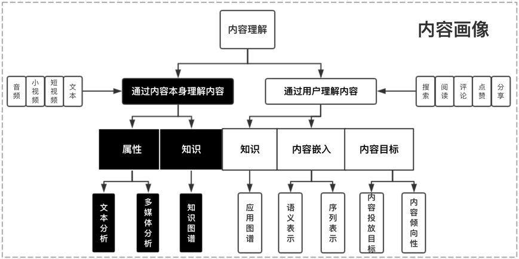

# 架构

召回（万/千） + 粗排（千） + 精排（百） + 重排（百） + 混排（业务线曝光）

## 1. 召回

### 任务 

从推荐池中选取成千上万的items送去后面的排序模块

### 要求

- 轻量快速低延迟

- 不需要十分准确，但不能遗漏

### 分类

#### 1.个性化召回

#### 2. 非个性化召回

### 召回的改进

#### 1.考虑用户层面：

用户兴趣的多元化，用户需求与场景的多元化：例如：新闻需求，重大要闻，相关内容沉浸阅读等等

#### 2.考虑系统层面：

增强系统的鲁棒性；部分召回失效，其余召回队列兜底不会导致整个召回层失效；排序层失效，召回队列兜底不会导致整个推荐系统失效 

#### 3.系统多样性内容分发：图文、视频、小视频；精准、试探、时效一定比例；召回目标的多元化，例如：相关性，沉浸时长，时效性，特色内容等等

#### 4. 可解释性推荐一部分召回是有明确推荐理由的：很好的解决产品性数据的引入

## 2.粗排

召回结果还是太多，还要过滤一下缓解精排的压力。其训练样本类似于精排，选取曝光点击为正样本，曝光未点击为负样本。但由于粗排一般面向上万的候选集，而精排只有几百上千，其解空间大很多。

## 精排

这一层的任务是获取粗排模块的结果，对候选集进行打分和排序。精排需要在最大时延允许的情况下，保证打分的精准性，是整个系统中至关重要的一个模块，也是最复杂，研究最多的一个模块。

开始的时候精排模型的常见目标是ctr,后续逐渐发展了cvr等多类目标。精排和粗排层的基本目标是一致的，都是对商品集合进行排序，但是和粗排不同的是，精排只需要对少量的商品(即粗排输出的商品集合的topN)进行排序即可。因此，精排中可以使用比粗排更多的特征，更复杂的模型和更精细的策略（用户的特征和行为在该层的大量使用和参与也是基于这个原因）

ctr点击率

CVR（Conversion Rate）：
转化率，CVR = 转化行为次数 / 点击次数

GMV（Gross Merchandise Volume）：
商品交易总额，指在特定时间内所有订单的总金额（含未支付订单）。反映平台或商家的整体交易规模，公式为：
GMV = 订单量 × 客单价

## 重排

### 任务

解决精排容易造成推荐结果同质化严重，有很多冗余信息的问题

### 优化目标

常见的有三种优化目标：Point Wise、Pair Wise 和 List Wise。重排序阶段对精排生成的Top-N个物品的序列进行重新排序，生成一个Top-K个物品的序列，作为排序系统最后的结果，直接展现给用户。重排序的原因是因为多个物品之间往往是相互影响的，而精排序是根据PointWise得分，容易造成推荐结果同质化严重，有很多冗余信息。而重排序面对的挑战就是海量状态空间如何求解的问题，一般在精排层我们使用AUC作为指标，但是在重排序更多关注NDCG等指标。

| **方法**    | **输入单位** | **优化目标**       | **典型损失函数**               | **例子**            |
| --------- | -------- | -------------- | ------------------------ | ----------------- |
| Pointwise | 单个样本     | 预测绝对值（如CTR、评分） | 均方误差（MSE）、交叉熵            | “预测用户给电影打几分”      |
| Pairwise  | 样本对      | 相对顺序（A是否应排在B前） | 合页损失（Hinge Loss）         | “用户点击的商品应排在未点击前”  |
| Listwise  | 整个列表     | 全局排序指标（如NDCG）  | 基于NDCG的近似损失（如LambdaLoss） | “推荐10个商品的NDCG最大化” |

## 混排

多个业务线都想在Feeds流中获取曝光，则需要对它们的结果进行混排。比如推荐流中插入广告、视频流中插入图文和banner等。可以基于规则策略（如广告定坑）和强化学习来实现。

## 画像层

推荐系统的物料库中，算法要对用户和商品画像，对新用户或者每隔几周就对整个物料库的用户打标签，为商品做内容理解。

## 文本理解

这应该是用的最多的模态信息，包括item的标题、正文、OCR、评论等数据。这里面也可以产生不同粒度的信息，比如文本分类，把整个item做一个粗粒度的分类。

这里的典型算法有：RNN、TextCNN、FastText、Bert等；

## 关键词标签

相比文本分类，关键词是更细粒度的信息，往往是一个mutil-hot的形式，它会对item在我们的标签库的选取最合适的关键词或者标签。

这里典型的算法有：TF-IDF、Bert、LSTM-CRF等。

## 内容理解

在很多场景下，推荐的主题都是视频或者图片，远远多于仅推荐文本的情况，这里视频/图片item中的内容中除了文本的内容以外，更多的信息其实来源于视频/图片内容本身, 因此需要尝试从多种模态中抽取更丰富的信息。主要包括分类信息、封面图OCR的信息、视频标签信息等

这里典型的算法有：TSN、RetinaFace、PSENet等。

## 知识图谱

知识图谱作为知识承载系统，用于对接内外部关键词信息与词关系信息；内容画像会将原关系信息整合，并构建可业务应用的关系知识体系，其次，依赖业务中积累用户行为产生的实体关系数据，本身用户需求的标签信息，一并用于构建业务知识的兴趣图谱，基于同构网络与异构网络表示学习等核心模型，输出知识表示与表达，抽象后的图谱用于文本识别，推荐语义理解，兴趣拓展推理等场景，直接用于兴趣推理的冷启场景已经验证有很不错的收益。

这方面的算法有：KGAT、RippleNet等。