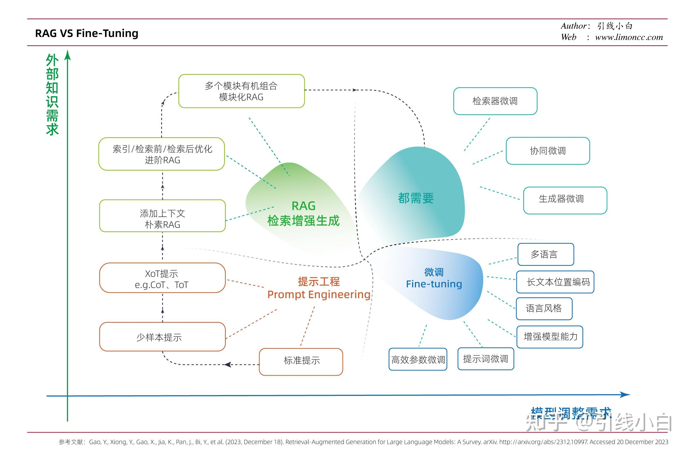

# 注意事项

## Q1: 超参数如何设定？

简单任务rank=16，alpha=32一般就ok了，Lightning AI有一篇技术分享专门讨论了，lora的参数设定问题。

[微调LLMs使用 LoRA 和 QLoRA：数百次实验的见解](https://lightning.ai/pages/community/lora-insights/#toc9)

选择 alpha 为秩的两倍（例如，r=256 和 alpha=512）的常见建议确实产生了最佳结果

## Q2：sft微调需要多少数据

根据任务难度，设定。这句话有点废。具体点，任务难度可以根据模型计算困惑度来衡量。你可以和一般任务对比，自行摸索一个阀值。这是定量。定性，如果提示词能够解决，难度较低，如果通过提示词不能解决，难度是有点，是中等，还是高根据模型已有的先验知识来定。所以一般难度100-300条数据就ok了，中等，困难问题一般需要1000以上，这个以上可能是3000，8000，1w或者10w加。

假设，对齐可以是一个简单的过程，模型学习与用户互动的风格或格式，以揭示在预训练中已经获得的知识和能力通过训练LIMA来衡量这两个阶段的相对重要性，LIMA是一个65B参数的LLaMa语言模型，仅在1000个精心标注的提示和回复上用标准的监督损失进行微调，且没有任何强化学习或人类偏好建模。

### 经验法则

- **模型参数与数据量的比例**：一个通用的经验法则是有效样本数≈模型参数数/1000。例如，一个拥有7亿参数的模型，通常需要约700万条有效样本来实现良好的泛化能力。但这个只是粗略估计，实际需求需结合任务和数据质量具体分析。

### 逐步增加数据量

- **从少量数据开始**：可以从较小的数据集开始训练，逐步增加数据量，观察验证集上的性能变化。如果增加数据量后模型性能有显著提升，说明还需要更多的数据；如果性能提升趋于平缓，甚至出现过拟合迹象，则可以停止增加数据量。

### 数据质量评估

- **基于聚类的方法**：可以利用聚类的思想筛选样本。先将数据重新格式化为指令调优训练阶段使用的训练输入格式，然后使用预先训练好的语言模型对所有样本进行编码，提取每个样本的句子嵌入。接着使用K-Means在嵌入空间中进行无监督聚类，选择频率最高的聚类的中心点作为该下游任务的分布中心点。最后，根据余弦相似度选择最相似的样本作为代表性的任务样本，使用核心集算法KCentergreedy选择核心样本。这种方法可以在较少的数据量下达到较好的微调效果。

### 监控模型表现

- **验证集评估**：定期在验证集上评估模型性能，确保数据量的增加确实提升了模型的泛化能力。如果模型在验证集上的性能没有提升，甚至下降，可能是因为数据量不足或数据质量不佳。

### 数据采样策略

- **随机采样或分层采样**：如果数据集过于庞大且存在冗余，可以采用随机采样或分层采样，选取具有代表性的样本进行训练。

### 数据质量指标

- **使用数据质量指标筛选**：可以参考一些数据质量指标来筛选数据，如Length（数据集中每个回复的平均长度）、Rewardscore（数据集中每对答案的平均奖励模型推理得分）、Perplexity（回复的指数化平均负对数可能性）等。通过这些指标挑选质量较高的数据用于微调。

## Q3: 学习率如何调整

一般lora微调学习率都设定为1e-4，其实很多时候，你要根据loss的情况，调高，或者调低，震荡比较大就调低，太慢就调高。根据任务酌情设定。

## Q4: 总是学不会，怎么办

如果你在各种超参数后，效果还是不理想。你第一个反思的应该是你的数据集和你想要的结果是否真的匹配，或者你的指令是否是模型友好的（困惑度比较低），或者你的数据存在不平衡。对，没错大模型时代数据平衡也还是很重要的。所以所谓高质量数据集并不是客户场景，或者业务场景有很多数据就够了。最后一公里其实是针对任务模型友好的数据集，能让模型快速学会。这就像一个好老师，一点就通。而差老师怎么教，你还是不会。

## Q5: 听说sft微调的越多，遗忘的越多

是的，不过对于小任务，rank比较低（例如8，16）的任务，影响还是有有限的。一般很少掉点明显。如果有你可以混合一些你想保留的原子能力的数据进去。

## Q6: 如何才能一次性微调想要模型学习到多个能力

肯定是可以的，注意相关性和比例，数据集必须是一个好老师，然后还要注意到我提到的以上内容。另外你也可以通过多阶段sft的方式学习多个能力。

## Q7: 微调需要很久么，需要多少GPU

普通企业能不能玩Qlora微调7b模型并不需要很多GPU，也不需要很久。一台12G显存的GPU即可，30分钟-2小时，对于中等任务而言。现在市面是4090租赁价格不过2元/小时。所以硬性成本不高。高的是针对特定能力的高质量数据集如果构建，以及能做微调的人才。我甚至和同时开玩笑说，我失业了我就去卖高质量数据集，我的广告词就是买我的数据集，微调一小时，能力全都有！主要一个省心省力，按能力大小和数据集制作成本收费。

## Q8: 处理sft微调，还能做其他微调么

有的，我们都知道RLHF，这个成本比较高，但是DPO和ORPO，针对偏好微调成本就低很多了。尤其ORPO和sft的成本几乎一样。唯一不同的是数据集需要有偏好对。而且偏好微调一个重要的特点是可以克服遗忘，sft是微调参数越多，遗忘越大。所以如果你想保留通用能力，偏好微调是比指令微调更好的选择。缺点就是数据集的制作成本高。偏好对要做到高质量是有难度的。Q9: 微调用什么框架如果你是大神，自己手搓trainer，如果是你高手，对模型比较懂，那就自己写peft，trl的trainer。如果你是专门做落地的，高应用的，没那么多时间手搓代码，你可以用诸如LLaMA-Factory、阿里的swift，书生xtuner、Firefly等，有很多。

## Q10: 在实践中如何选择做提示词工程、RAG知识库、微调

一张图解决你的困惑

